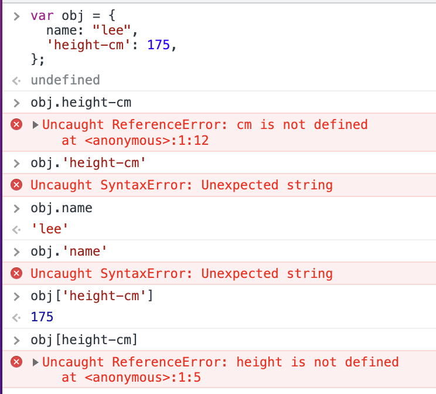
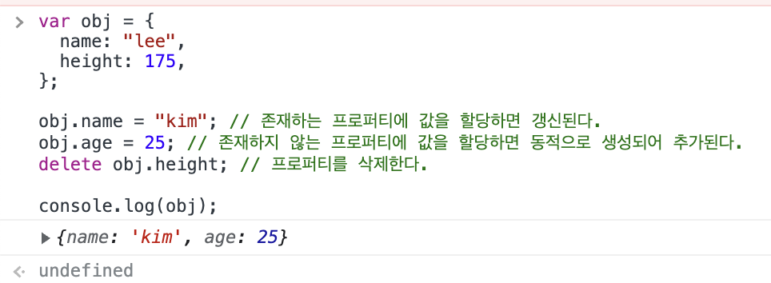

# ch10. 객체 리터럴

## 객체

0개 이상의 프로퍼티로 구성된 집합, 프로퍼티는 키와 값으로 구성된다.  
js의 모든 값은 프로퍼티가 될 수 있으며 특히 프로퍼티가 함수일 때 이 함수를 메서드라고 부른다.

## 객체 리터럴

객체 생성에는 여러가지 방법이 있고 가장 일반적이고 쉬운 방법은 객체 리터럴을 사용하는 것이다.  
{} 내에 프로퍼티를 정의하며 변수 할당시에 객체가 생성된다.  
객체 리터럴의 {}는 코드 블록이 아니고 표현식이므로 세미콜론을 붙인다.

## 프로퍼티

객체는 프로퍼티의 집합이다. 프로퍼티는 키와 값으로 구성된다.

- 키 : 문자열 또는 심벌 값
- 값 : js에서 사용하는 모든 값

문자열로 키를 쓸 때는 따옴표로 묶어야 하지만 식별자 네이밍 규칙을 따르는 경우에는 따옴표를 생략할 수 있으며 식별자 네이밍 규칙을 준수하는 것이 권장된다.  
같은 이름의 키를 중복 선언시 나중의 것으로 덮어써진다.

## 메서드

## 프로퍼티 접근

- . 를 사용하는 마침표 표기법
- [] 를 사용하는 대괄호 표기법

마침표 표기법을 사용하는 경우 프로퍼티 키를 따옴표 없이 써야 한다. 대괄호 표기법을 사용하는 경우 프로퍼티 키를 따옴표로 감싸야 한다.
따라서 식별자 네이밍 규칙을 지키지 않은 키는 따옴표로 감싸져 있을 것이므로 대괄호 표기법으로만 접근할 수 있다.



## 갱신, 동적 생성, 삭제



## ES6에서의 확장 기능

### 프로퍼티 축약

프로퍼티 값으로 변수를 사용하고 변수 이름과 프로퍼티 이름이 동일할 때 키값을 생략할 수 있다.

```js
var x = 1;
var y = 2;

// 다음 두 예제는 같은 형식의 객체를 만든다.
var obj = { x: x, y: y };
var obj2 = { x, y };
```

### 계산된 프로퍼티 이름

문자열 또는 문자열로 평가되는 표현식을 []로 묶어 프로퍼티 키를 동적으로 생성하는 것을 계산된 프로퍼티 이름이라고 한다.
ES6에서는 객체 리터럴 내부에서도 이 방식으로 생성이 가능해졌다.

### 메서드 축약 표현

메서드 정의시 함수의 function 키워드를 생략해 쓸 수 있다.

```js
const obj = {
  name: "kim",
  say() {
    // function 키워드 생략
    console.log(`hello`);
  },
};
```

# ch11. 원시 값과 객체의 비교

원시 값은 변경이 불가능하다. 이는 변수 값을 변경할 수 없다는 뜻이 아니다.  
변수에 새로운 원시값을 할당하게 되면 원시값은 바뀔 수 없으므로 새로운 새로운 메모리 공간을 확보해 원시 값을 다시 저장하고 변수는 이제 새로운 메모리 공간의 주소를 가리키는 식별자가 된다. 기존의 원시값은 바뀌지 않고 그대로 남아있다. (연결된 식별자가 없으니까 가비지 컬렉션의 대상이 될 것이다)

## 문자열

js에서의 문자열은 원시 타입의 값이다. 따라서 변경이 불가능하며 변수에 다른 문자열을 재할당 하는 경우 다른 원시 값들 처럼 역시 새로운 메모리 공간에 문자열을 재할당하고 식별자는 새로운 메모리 주소를 가리킨다.
문자열은 유사 배열이므로 인덱스를 통해서 각 문자에 접근 할 수도 있지만 변경은 불가능 하다.

다만 여기서 의문점, 문자열은 길이가 제각각 이므로 다른 원시값처럼 항상 같은 메모리 공간에 저장할 수 없지 않는가?
책에서는 식별자는 **문자열이 저장된 메모리 공간의 첫 번째 메모리 셀 주소**를 가리킨다고 되어있다. 식별자가 가리키는 주소에는 다른 원시 값과 달리 값 자체가 아닌 문자열이 저장된 메모리 공간의 주소가 들어 있고 이걸 한 번 더 거쳐야 문자열에 도착한다는 이야기가 된다.

- [ ] 이것은 마치 문자열을 변수에 저장하는 방식이 객체와 같은 방식이라는 뜻이 맞는건지? 객체 또한 길이를 특정할 수 없으므로 객체가 저장된 식별자가 가리키는 주소에는 객체가 저장된 메모리 공간의 주소가 들어있을 테니까? 하지만 문자열은 사전 길이가 정해져 있으니 (=동적으로 수정이 불가능 하니) 같지는 않을 것 같고

## 값에 의한 전달

변수에 원시 값을 저장한 변수를 할당하는 경우에는 무슨 일이 일어나는 것일까?
할당되는 변수에는 원래 변수의 원시 값 자체가 복사되어 전달된다.

- [ ] 순서가 어떻게 되는지가 궁금했다. 원래 있던 변수가 가리키는 메모리 주소에 들어있는 원시값을 복사한 후, 새로운 메모리 주소에 붙여넣은 뒤 이 새로운 메모리 주소를 새로운 변수에 전달하는 순서인가? 아니면 새로운 변수가 가리킬 메모리 공간이 할당 된 후 이전 변수가 가리키는 메모리 주소의 변수 값을 복사해 와서 붙여 넣는 것인지?

어쨋든 중요한 점은 두 식별자가 가리키는 메모리 주소는 서로 다르므로 어느 한 쪽에서 변수 값을 수정한다 한들 **다른 쪽에는 영향을 미치지 않는다**는 것이다.

## 객체

객체는 동적으로 프로퍼티가 추가 가능하고 프로퍼티 값의 타입에 제약이 없기 때문에 원시 값처럼 처음에 필요한 메모리 공간을 정할 수 없고 원시 값과는 다른 식으로 동작한다.
일단 변수가 객체를 참조하는 방식을 보자. 객체가 할당된 변수는 어떠한 메모리 주소를 가리킬 것이고 그 메모리 주소에 가면 원시 값처럼 값이 있는 것이 아니라 객체가 저장된 메모리 주소가 대신 들어있다. 이 저장된 메모리 주소를 참조하면 객체에 접근이 가능한 것이다.

또한 객체를 만들고 관리하는 것은 복잡하고 비용이 많이 들기 때문에 효율을 위해서 객체는 변경 가능한 값으로 설정되어 있다.
이 말은 변경이 일어날 경우 새로운 메모리에 값을 생성하고 식별자가 가리키는 메모리 주소를 변경하는 것이 아니라 말 그래도 객체가 저장된 메모리의 값을 수정한다는 것이다.

### 얇은 복사와 깊은 복사

- [ ] 정리하기

## 참조에 의한 전달

새로운 변수에 객체가 할당된 변수를 할당한다고 생각해 보자. 원시 값의 경우 값을 복사해 새로운 메모리 주소를 전달하므로 한 쪽이 수정해도 다른 쪽에는 영향이 없다.  
하지만 객체의 경우는 어떨까? 객체는 참조값(객체가 있는 메모리 주소)이 복사되어 전달된다.

새로운 변수에 객체가 할당된 변수를 할당하면 새로운 메모리 공간에 객체의 참조값이 복사되고 새로운 변수는 이 새로운 메모리 주소를 가리킨다. 이 경우 두 변수가 가리키는 메모리 주소는 각각 다르다. 하지만 그 메모리 주소에 들어있는 값은 객체의 참조값으로 서로 같다.
결국 변수는 자신이 가리키는 메모리 주소에 있는 참조값을 통해서 객체에 접근하기 때문에 두 변수는 같은 객체를 공유하고 있다.  
따라서 어느 한 쪽의 변수를 통해 객체를 수정하면 다른 쪽도 영향을 받는다.
