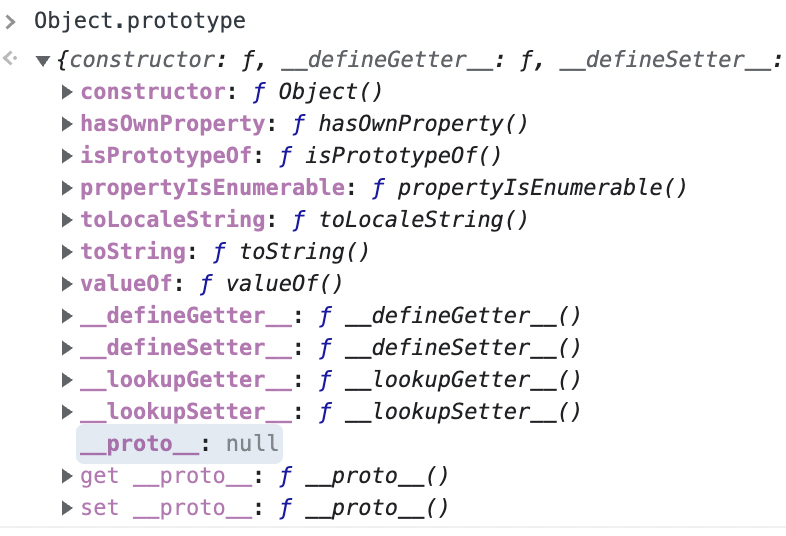

# ch19. 프로토타입

아직 잘 와닿지가 않는다.

Javascript는 프로토타입 기반 객체지향 프로그래밍 언어이다.
이 챕터에서 말하는 프로토타입은 모든 객체가 가지고 있는 [[prototype]] 이라는 내부 슬롯을 뜻하는 것이다.

## 상속

js는 프로토타입을 이용해서 상속을 구현한다.  
상속은 어떤 객체의 프로퍼티 / 메서드를 다른 객체가 그대로 사용할 수 있는 것을 말한다.

## 프로토타입 객체

생성자 함수와 함수와 프로토타입 객체는 별개로 존재한다. 또한 생성자 함수로 생선된 객체의 [[prototype]]내부 슬롯이 프로토타입 객체를 참조하고 있다. 직접 접근은 불가능하며 `__proto__` 접근자 프로퍼티를 통해서 접근이 가능하다.  
그럼 내부 슬롯이 참조하고 있다는 프로토타입 객체의 정체는 무엇일까? 이는 객체 생성 방식에 따라서 다르다.

## `__proto__`

객체가 직접 소유하는 프로퍼티가 아니라 Object.prototype의 프로퍼티로 상속을 통해 객체가 사용할 수 있다.  
Object.prototype은 무엇이고 또 어떻게 상속을 받아서 쓴다는 건가? 이것은 프로토타입 체인에서 다룬다.

## 프로토타입 생성 시점

### 사용자 정의 생성자 함수

함수 정의가 평가되어 함수 객체를 생성하는 시점에 프로토타입이 생성된다.  
js에서는 함수 호이스팅에 의해서 함수 선언은 런타임 이전에 평가되어서 객체를 생성한다. (그래서 선언이 참조보다 뒤에 코드가 있어도 사용 가능)  
생성자 함수의 prototype 프로퍼티의 값은 해당 생성자 함수가 생성한 프로토타입을 가리키고 생성된 프로토타입은 객체이므로 [[prototype]] 내부 슬롯을 가지고 Object.prototype을 참조한다.

### 빌트인 생성자 함수

일반 함수와 마찬가지로 빌트인 생성자 함수가 생성되는 시점(= 전역 객체가 생성되는 시점)에 프로토타입도 생성된다.  
생성된 프로토타입은 빌트인 생성자 함수의 prototype 프로퍼티 (생성자 함수이므로 prototype 프로퍼티가 존재함)에 바인딩된다.

그럼 질문. 예컨대 빌트인 생성자 함수인 Object 생성자 함수는 전역 객체가 생성되는 시점에 Object.prototype을 생성한다. 이 Object.prototype은 객체이기 때문에 [[prototype]] 내부 슬롯을 가질 것이다. 이 값은 무엇일까?  
null이다. 그리고 이 사실은 중요하다. (뒤에 읽다보니...)

## 객체 생성 방식과 프로토타입 결정

## 프로토타입 체인

사용자 정의 생성자 함수에 의해서 생성된 객체를 생각해보자.

여기를 읽으니까 정리가 된다. 이 프로토타입 체인([[prototype]] 내부 슬롯의 참조를 따라서 프로퍼티를 검색하는 메커니즘)으로 상속(어떤 객체가 다른 객체의 프로퍼티 / 메서드를 사용하는 것)이라는 개념을 구현하고 있는 것이다.  
상속이라는 것은 객체지향 프로그래밍의 어떠한 추상적인 개념이고 프로토타입 체인으로 js에서는 그것을 구현하고 있는 것이었다.  
그 말은 다른 언어에서는 상속이라는 개념을 구현하기 위해 다른 방법을 쓰고(쓸 수도)있다는 것이겠지?

## 오버라이딩과 프로퍼티 섀도잉

인스턴스에

## 프로토타입의 교체
