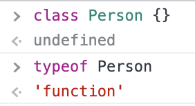
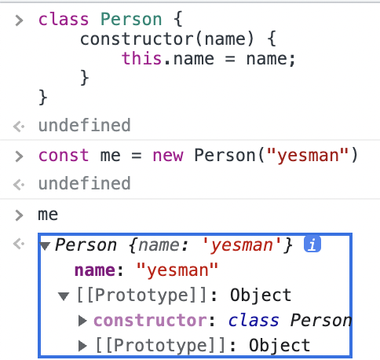
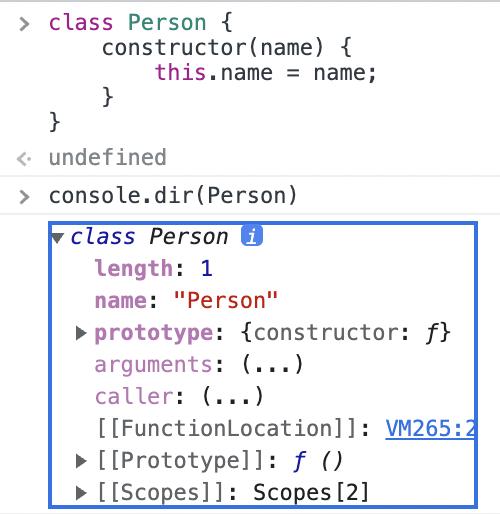
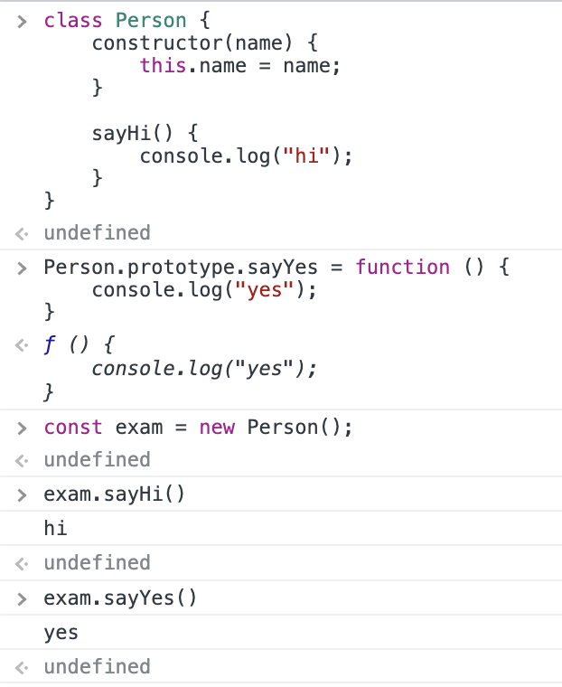
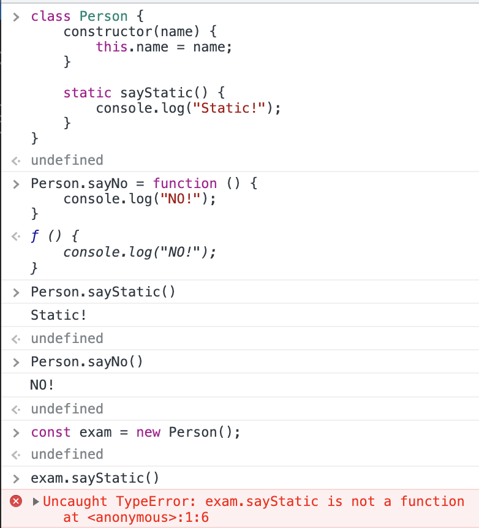
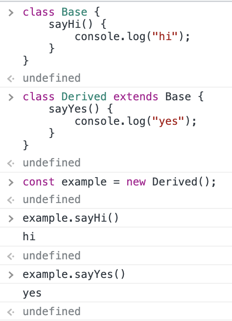
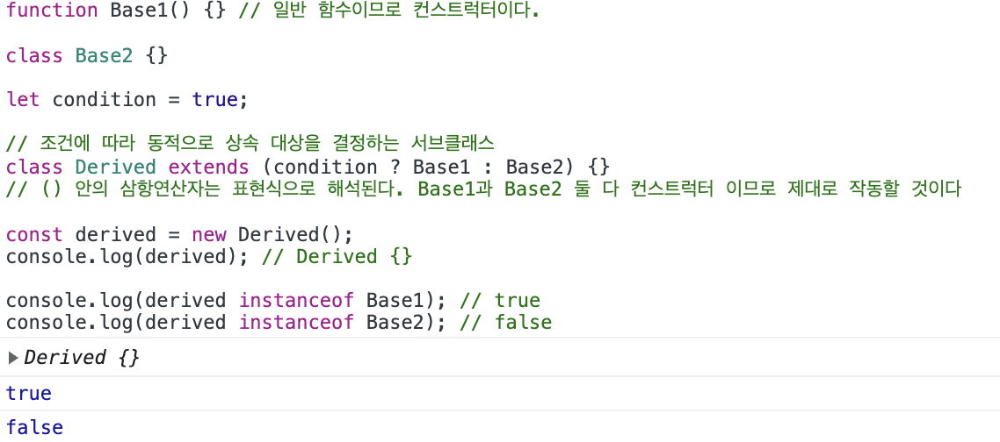
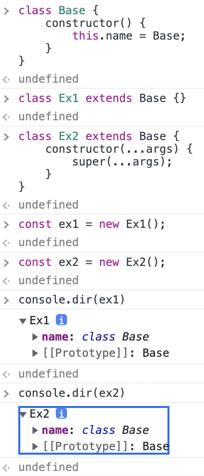

# ch25. 클래스

js는 프로토타입을 기반으로 객체지향 프로그래밍을 구현할 수 있다. 하지만 ES6에서는 클래스 기반 객체지향을 다루었던 프로그래머들이 js를 더 잘 학습할 수 있도록 클래스 기반 객체지향과 비슷하게 객체를 만들 수 있는 메커니즘을 만들었는데, 이것이 js의 클래스다. 하지만 js의 클래스는 이전의 생성자 함수처럼 여전히 프로토타입 기반으로 객체지향을 구현하고 있다.

따라서 클래스를 문법적 설탕 (같은 동작을 하나 사용자가 쓰기 쉽게 새로운 문법을 제공하는 것)으로 볼 수 도 있겠지만 생성자 함수와 달리 다음과 같은 차이점디 있다.

- 클래스는 new 없이 호출이 불가능하다.
- 상속 관련 extends 와 super 키워드가 있따.
- 클래스는 let, const 처럼 호이스팅이 발생하지 않는 것처럼 동작한다.
- 암묵적으로 엄격 모드가 지정되어 있으며 해제가 불가능하다.
- 클래스의 constructor, 프로토타입 메서드, 정적 메서드는 [[Enumerable]]의 값이 false로 설정된다.

그런 이유로 책에서는 클래스를 문법적 설탕이 아닌 새로운 객체 생성 방법으로 보고 있다.

## 정의

클래스는 class 키워드로 정의한다. 클래스 이름은 파스칼 케이스를 사용하는 것이 권장된다. (필수는 아니다)

```js
class Person {}
```

클래스는 함수이므로 값처럼 사용할 수 있는 일급 객체이며 표현식으로 정의할 수 있다.



클래스 몸체에는 메서드만 정의할 수 있다.

## 호이스팅

클래스는 함수이므로 호이스팅이 발생한다. 클래스 선언은 런타임 이전에 평가되어 함수 객체를 생성한다. 하지만 일반 함수와는 달리 정의하기 전에 참조를 할 수가 없다. 이것은 마치 let 과 const 처럼 선언과 초기화가 분리되어 실행되어 TDZ가 생성되기 때문이다.

## 인스턴스 생성

클래스는 함수, 그리고 생성자 함수이다. 따라서 new와 함께 호출되어 인스턴스(객체)를 생성한다. 함수와 마찬가지로 클래스 이름은 클래스 내부에서만 참조가 가능하기 때문에 표현식으로 정의된 경우 식별자 이름으로 호출해야 한다.

다만 일반 함수와는 달리 반드시 new와 함께 호출해야 한다.

## 메서드

클래스 몸체에는 메서드만이 정의가 가능하다.

### constructor

인스턴스 생성과 초기화에 사용되는 특별한 메서드이다. 다음의 예제를 보자.



this에 추가한 name 프로퍼티가 인스턴스의 프로퍼티로 들어가 있다. 또한 자신을 생성한 생성자 함수를 가리키는 constructor 가 class를 가리키고 있다. 이처럼 클래스도 생성자 함수처럼 동작하며 클래스의 constructor 내부의 this는 생성자 함수가 인스턴스를 생성할 때와 똑같이 클래스(생성자 함수)가 생성하게 될 인스턴스에 바인딩이 되어 있다는 것을 알 수 있다.

헌데 이상한 점이 있다. 프로토타입의 constructor 프로퍼티 말고 인스턴스를 생성하고 초기화 할때 썼던 constructor 메서드가 클래스 내에 없다. 분명히 함수의 메서드인데 왜 표시가 되지 않는가?



사실 이 constructor 는 메서드로 해석되지 않고 클래스가 평가되어 생성한 함수 객체 코드의 일부분이 된다고 한다. 이름도 헷갈리는데 동작 방식도 특이하네...

어쨋든 constuctor 는 최대 하나만 존재할 수 있고 또한 매개변수를 받아서 인스턴스 생성시 초기값으로 사용할 수 있다. 생략이 암묵적으로 빈 constructor 가 정의된다. 이 경우 constructor 가 비었으므로 해당 클래스가 생성할 인스턴스도 빈 객체가 된다.

생성자 함수와 마찬가지로 호출시 생성한 인스턴스를 반환하므로 별도의 반환문을 적지 않는 것이 좋다.

## 프로토타입 메서드

인스턴스가 상속을 받아서 사용할 수 있는 프로토타입 메서드를 생성할 수 있다. 생성자 함수와 마찬가지로 프로토타입 체인이 구축되어 상속을 구현한다. 정의할 떄는 클래스 내에서 바로 메서드를 추가하면 된다. 생성자 함수처럼 prototype 프로퍼티에 직접 추가하는 방법도 유효하다.



## 정적 메서드

생성자 함수와 마찬가지로 동작하는 정적 메서드를 정의할 수 있다. 클래스 몸체 내에서 static 키워드를 붙이면 된다. 생성자 함수처럼 클래스 이름에 직접 추가하는 방법도 유효하다. 생성자 함수의 경우와 마찬가지로 클래스(함수임)에 바인딩된 메서드이기 때문에 인스턴스의 프로토타입 체인에 존재하지 않고 인스턴스가 호출할 수 없다.



## 언제 쓸 것인가

무엇을 프로토타입 메서드로 하고 무엇을 정적 메서드로 해야할까? 이에 대한 답은 둘의 호출의 주체가 다르다는 것에서 찾을 수 있다.  
메서드 내의 this는 메서드를 호출한 객체에 바인딩 된다. 따라서 정적 메서드 내부의 this는 메서드가 정의된 클래스가 될 것이고, 프로토타입 메서드 내부의 this는 클래스가 생성한 인스턴스가 될 것이다.

따라서 constructor에서 정의한 인스턴스의 프로퍼티를 메서드 내부에서 써야 한다면 this를 사용해야 할 것이고, 이때 this는 인스턴스를 가리켜야 하므로 이 메서드는 프로토타입 메서드로만 정의되어야 한다.

this를 쓸 일이 없다면 어떨까? 프로토타입 메서드와 정적 메서드 둘 다 사용 가능하다. 하지만 this가 필요 없는 메서드를 프로토타입 메서드로 정의한다면 인스턴스 프로퍼티를 참조할 필요도 없는데 단지 프로토타입 메서드를 실행하기 위해서 인스턴스를 먼저 생성해야 하므로 비효율적이다. 따라서 이 경우에는 정적 메서드로 정의한다.

또한 클래스(또는 생성자 함수)의 이름 아래에 관련 기능들을 정적 메서드로 정의해 모아 두면 전역에서 사용할 기능을 전역 함수로 정의하는 것보다 관리도 쉽고 이름 충돌할 가능성도 낮아지는 좋은 점이 있다.

### 클래스의 메서드의 특징

- ES6의 메서드 축약 표현을 사용한다.
- 콤마가 필요 없다.
- 엄격 모드로 실행된다.
- [[Enumerable]] 프로퍼티 어트리뷰트의 값이 false다. 즉 열거할 수 없다.
- non-constructor이다. 따라서 new와 함께 호출하여 생성자 함수로 동작하지 않는다.

## 인스턴스 생성 과정

이것은 생성자 함수가 인스턴스를 생성하는 것과 유사하게 이루어진다. new 연산자와 함께 클래스를 호출하면 먼저 빈 객체가 생성되고, 이 객체의 프로토타입으로 ([[prototype]]이 참조하는 것) 클래스의 prototype 프로퍼티가 가리키는 객체가 설정된다, 그리고 this가 이 객체에 바인딩된다.  
그 다음 constructor 내부 코드가 실행되며 인스턴스를 초기화 하고 마지막으로 인스턴스가 바인딩된 this가 반환된다.

## 프로퍼티

인스턴스의 프로퍼티는 constructor 내부에 정의한다. constructor 내부의 this에 프로퍼티를 추가하면 클래스가 생성할 인스턴스의 프로퍼티가 된다.

### 접근자 프로퍼티

접근자 프로퍼티 또한 사용가능하다. 다만 constructor 내부가 아닌 클래스 몸체 내부에 선언한다. 따라서 클래스의 접근자 프로퍼티는 프로토타입 프로퍼티가 된다.

### 클래스 필드 정의 제안

### private 필드 정의 제안

### static 필드 정의 제안

## 상속에 의한 클래스 확장

클래스에 의한 상속은 프로토타입 기반 상속과는 다르게 상속에 의한 확장이 가능하다는 차이점이 있다. 클래스는 상속을 통해 상속 받은 클래스의 속성을 사용하면서 자신의 고유한 속성을 추가해 사용할 수 있다.

## extends 키워드

상속을 통한 클래스 확장을 위해 사용되는 것이 extends 키워드이다. 다음과 같은 방법으로 작동한다.



상속을 통해 확장된 클래스를 서브클래스, 서브클래스에 상속된 클래스를 수퍼클래스라고 부른다.

### 동적 상속

extends 키워드의 좌변, 즉 상속을 하는 쪽은 클래스 뿐만 아니라 [[Construct]] 내부 메서드를 갖는 함수 객체(로 평가될수 있는 모든 표현식)를 시용할 수 있다. 책의 예제로 확인해 보았다.



### 서브클래스의 constructor

서브클래스의 constructor를 생력하면 암묵적으로 수퍼클래스의 constructor를 호출하는 방식의 모드가 정의된다.



## super 키워드

이전의 예제에서 등장한 super는 무엇일까? super는 호출도 되고 식별자처럼 참조도 할 수 있는 특수한 키워드이다.

- super를 호출하면 수퍼클래스의 consturctor를 호출한다.
- super를 참조하면 수퍼클래스의 메서드를 호출할 수 있다.

### super 호출
