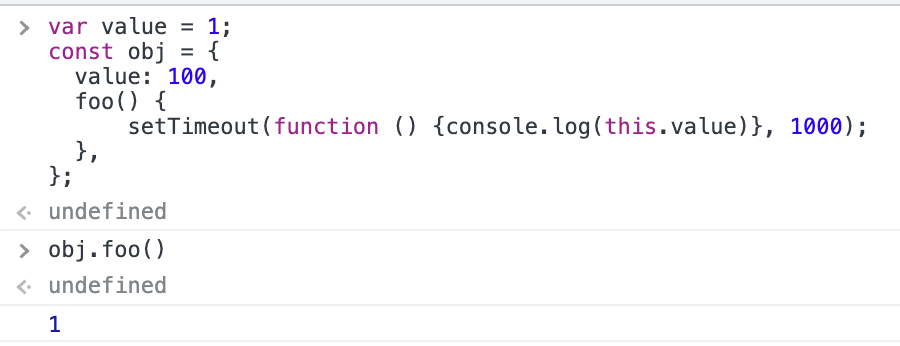
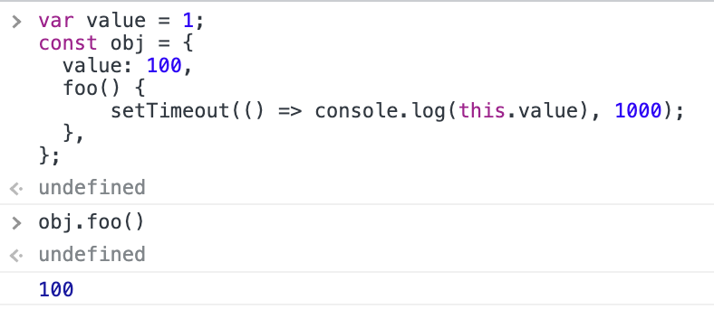
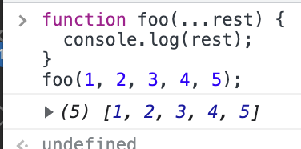
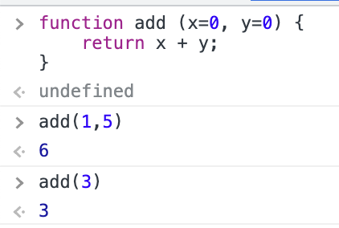

# ch26. ES6 함수의 추가 기능

ES6이전의 js 함수는 일반 함수 호출, 메서드, 생성자 함수로 사용 가능했다. 이러한 자유로움은 실수 유발을 할 수도 있으며 모든 경우에 constructor 인 것은 성능상의 손해를 가져왔다. 이러한 이유로 ES6에서는 상황에 맞도록 기능을 추가하거나 제거하야서 사용 목적에 따른 분류를 하였다.

- 일반 함수 : 함수 선언문과 함수 표현식을 일컫는 것이다.
- 메서드 : ES6의 메서드 축약 표현만을 인정한다.
- 화살표 함수

## 메서드

원래 메서드는 객체에 바인딩 된 함수를 말하였으나 ES6 사양에서는 메서드 축약 표현으로 정의된 함수만을 의미한다. 따라서 객체 내에 메서드를 정의하여도 축약 표현이 아닌 경우에는 여기서 말하는 메서드로 취급되지 않는다.

메서드는 non-constructor 이다. 객체에 바인딩되어서 객체의 부가 기능으로 사용되는 것이 메서드 이므로 생성자 함수로 호출할 이유가 없기 때문에 constructor의 기능을 제거하였다. 따라서 prototype 프로퍼티가 없고 프로토타입을 생성하지 않으므로 메모리를 절약할 수 있다.  
반면 메서드 본연의 역할에 맞게 [[HomeObject]] 내부 슬롯을 가져서 자신을 바인딩한 객체를 가리키게 함으로써 클래스의 super 참조가 가능하게 하였고 이는 상속 관계에서 메서드를 유용하게 쓸 수 있게 되었다. 이러한 변경점을 통해 ES6의 메서드 축약 표현은 메서드에 적합하게 바뀌었으므로 이제 객체의 메서드를 정의할 때 함수 표현식을 할당하는 이전의 방식은 하지 않는 것이 좋다.

## 화살표 함수

또 하나 추가된 것은 화살표 함수이다. 먼저 함수 정의시 코드를 간략하게 할 수 있으며 내부 동작또한 이전의 함수와는 다르다. 여러가지 세부 사항이 있지만 기본 틀은 다음과 같다.

```js
// 함수 선언문 형식으로 사용할 수 없고 함수 표현식으로 정의해야 한다.
const add = (x, y) => x + y;
```

### 일반 함수와의 차이

- non-constructor이다. 따라서 prototype 프로퍼티가 없고 프로토타입도 생성하지 않는다.
- 중복된 매개변수 이름을 선언할 수 없다. (일반 함수는 엄격모드에서만 이렇다)
- 함수 자체의 this, arguments, super, new.target 바인딩을 가지지 않는다.
- 따라서 화살표 함수 내부에서 저것들을 참조하면 스코프 체인을 통해 상위 스코프에서 해당 값을 찾는다.

### this

함수 자체의 this 바인딩이 없다는 것은 화살표 함수의 가장 큰 특징으로 화살표 함수는 보조 함수 내부의 this와 외부 함수의 this 바인딩이 서로 달라서 보조 함수가 제 역할을 하지 못하는 문제를 해결하기 위해서 고안되었다.  
일반 함수로 this를 호출시 그 함수가 콜백이나 내부 함수여도 여전히 일반 함수 호출이기 때문에 this는 전역 객체를 가리키게 되었고 이는 논리적인 구조가 아니었다. ES6이전에는 변수를 따로 선언해 this를 저장하거나 bind를 이용하여 둘을 같은 값으로 맞추어 주었는데 화살표 함수는 이 문제를 더 간결하게 해결할 수 있도록 해준다.

다음 예제에서 this는 일반 함수 호출에서의 this가 되어 의도는 객체 내의 value = 100을 참조하고 싶었으나 전역 var 변수 (= 전역 객체의 프로퍼티이다)의 값 1이 나오게 된다.



콜백 함수를 화살표 함수로 정의하면 화살표 함수는 this가 없기 때문에 스코프 체인을 따라 다음 상위 스코프에서 this를 검색하게 되고 이번에는 의도대로 100이 출력된다.



- [ ] 추가 내용

### super

화살표 함수는 함수 자체의 super 바인딩을 갖지 않는다. 화살표 함수는 ES6 메서드가 아니기 때문에 [[HomeObject]]를 가지지 않는다. 헌데 super를 참조해도 에러가 발생하지는 않고 상위 스코프인 consturctor의 super를 가리키게 된다.

### arguments

마찬가지로 함수 자체의 arguments 바인딩을 갖지 않는다. araguments를 참조할 경우 상위 스코프의 argumetns를 참조한다. 따라서 화살표 함수에서 가변 인자 함수를 구현할 때에는 **Rest 파라미터**를 사용한다.

## Rest 파라미터

Rest 파라미터는 매개변수 이름 앞에 ... 을 붙여서 정의한다. 함수에 전달한 인수들을 배열로 전환해 전달받는다.



Rest 파라미터는 인수들을 배열로 바로 전환하므로 이전의 유사 배열 객체인 arguments 객체에 배열 메서드를 적용하고 싶을 떄 먼저 배열로 바꾸어주어야 했던 번거로움을 줄일 수 있다.

## 매개변수 기본값

js는 매개변수의 개수와 인수의 개수가 일치하는지 체크하지 않고 인수가 전달되지 않은 매개변수를 undefined로 만들기 때문에 이는 예상치 못한 결과를 초래할 수 있다. 이를 단축 평가로 방어할 수 있었는데 ES6에서 도입된 매개변수 기본값을 사용하면 좀 더 간편하게 사용할 수 있다.



이것은 매개변수에 인수들 전달하지 않거나 undefined를 전달한 경우에만 작동한다.
