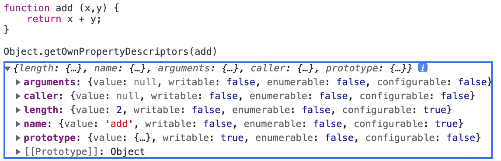

# 16. 프로퍼티 어트리뷰트

## 내부 슬롯과 내부 메서드

js 엔진 구현을 위해서 ECMA 사양에서 정의하는 의사 프로퍼티 / 메서드이다.  
중요한 것은 이것은 엔진 내부 로직이므로 외부에서 접근할 수 없는 것이 기본이다. 다만 일부에 한해서 간접적인 접근 방법을 제공하기도 한다.

- [[Prototype]] : 객체의 프로토타입 객체가 바인딩되어 있는 내부 슬롯, `__proto__`로 간접 접근이 가능하다.

```js
const obj = {};

obj.[[prototype]] // Uncaught SyntaxError
obj.__proto__ // Object.prototype
```

## 프로퍼티 어트리뷰트 / 프로퍼티 디스크립터 객체

js 엔진은 프로퍼티 생성 시 프로퍼티 상태를 나타내는 프로퍼티 어트리뷰트를 기본값으로 자동 설정한다.  
이 프로퍼티 상태란 값, 갱신 가능 여부, 열거 가능 여부, 재정의 가능 여부의 4가지를 의미하며 이 값들은 각각 내부슬롯 [[Value]], [[Writable]], [[Enumeralbe]], [[Configurable]] 에 저장되어 있어 직접 접근을 불가능 하나 위의 `__proto__` 처럼 간접적으로 확이할 수 있는 방법인 Object.getOwnPropertyDescriptor 가 제공된다.


이 반환값은 **프로퍼티 디스크립터 객체**라고 부른다.  
첫 번째 매개변수에는 객체의 참조, 두 번째 매개변수는 프로퍼티를 문자열로 전달한다. 존재하지 않거나 상속받은 프로퍼티를 전달하면 undefined가 반환된다.

끝에 s를 붙인 Object.getOwnPropertyDescriptors 는 객체 참조를 전달받아 모든 프로퍼티에 대해 프로퍼티 디스크립터 객체를 반환한다.

## 데이터 프로퍼티

데이터 프로퍼티는 일반적인 키 - 값의 형태를 가지고 있으며 js 엔진이 프로퍼티를 생성할 시 기본값으로 자동 정의되는 4가지 프로퍼티 어트리뷰트를 가진다.

- [[Value]] : 프로퍼티 값에 접근시 반환되는 값
- [[Writable]] : 변경 기능 여부 (불리언), false 일 경우 읽기 전용이 된다.
- [[Enumeralbe]] : 열거 가능 여부 (불리언), false 일 경우 for .. in dlsk Object.keys 로 열거할 수 없다.
- [[Configurable]] : 재정의 가능 여부 (불리언), false 일경우 해당 프로퍼티 삭제, 프로퍼티 어트리뷰트 값의 변경이 금지된다.

위의 예제에서 보았듯 프로퍼티 생성 시 [[Value]]의 값은 프로퍼티 값으로, 나머지 3개의 슬롯 true 로 초기화된다.

## 접근자 프로퍼티

접근자 프로퍼티는 자체 값이 없고 다른 데이터 프로퍼티의 값을 읽거나 저장할 때 사용하는 접근자 함수로 구성된 프로퍼티다. 따라서 프로퍼티 어트리뷰트에도 차이점이 있다.

- [[Get]] : 접근자 프로퍼티 키로 접근하면 호출되는 **함수**이다. 데이터 프로퍼티 값을 읽는 용도로 사용한다.
- [[Set]] : 접근자 프로퍼티 키에 값을 할당하면 호출되는 **함수**이다. 데이터 프로퍼티 값을 저장하는 용도로 사용한다.
- [[Enumeralbe]] : 데이터 프로퍼티의 [[Enumeralbe]] 와 같다.
- [[Configurable]] : 데이터 프로퍼티의 [[Configurable]] 와 같다.

접근자 프로퍼티는 객체 내에서 get(set) [접근자프로퍼티]로 정의가 가능하다.


get과 set 함수를 정의하고 뒤에 나오는 이름이 접근자 프로퍼티가 된다. 각 get 함수와 set 함수가 실행할 로직을 작성한다.  
이제 접근자 프로퍼티에 값을 저장하면, set(setter) 함수가 호출되고 이 함수는 인자로 받은 것을 split 하여 디스트럭처링 할당하는 함수이므로 해당 내용이 실행된다.

접근자 프로퍼티를 참조하면, get(getter) 함수가 호출되고 객체의 프로퍼티를 리턴하는 내용의 함수가 실행된다.

이처럼 접근자 프로퍼티의 set, get 어트리뷰트 함수를 이용하여서 다른 데이터 프로퍼티에 대한 작업을 할 수 있다.

기본적으로 get,set 은 다른 데이터 프로퍼티 값을 읽거나 저장하는 용도로 사용되기 위해 고안되었지만, 결국 단순히 함수일 뿐이며 그 작동 방식은 사용자가 직접 선언해서 사용하게 된다. 따라서 그러한 용도로 쓰지 않아도 여전히 get, set은 호출되며 작동은 한다.

데이터 프로퍼티와 전혀 연관 없는 작업을 지시하는 것도 가능은 하다.


## 프로퍼티 정의

새로운 프로퍼티를 추가하면서 프로퍼티 어트리뷰트를 명시적으로 정의하거나, 기존 프로퍼티의 프로퍼티 어트리뷰트를 재정의하는 것이다.  
다시 말해, 프로퍼티의 [[Value]], [[Writable]], [[Enumeralbe]], [[Configurable]], [[Get]], [[Set]] 의 값을 변경할 수 있다.

프로퍼티 정의는 Object.defineProperty 메서드를 사용한다. 객체 참조와, 프로퍼티 키 (문자열), 프로퍼티 디스크립터 객체를 순서대로 메서드에 전달한다.

Object.defineProperty를 사용할 때 프로퍼티 디스크립터 객체에서 프로퍼티를 일부 생략할 수 있는데, 생략되는 경우 [[Value]], [[Get]], [[Set]] 은 undefined로, [[Writable]], [[Enumeralbe]], [[Configurable]] 는 false를 기본값으로 적용된다.

Object.defineProperties 메서드는 한 번에 여러개의 프로퍼티를 동시에 정의할 수 있다.

## 객체 변경 방지

객체는 기본적으로 변경 가능한 값이며, 프로퍼티 정의 메서드로 프로퍼티 어트리뷰트들 재정의할 수도 있다.

이와 함께 js는 객체의 변경을 방지하는 다양한 메서드를 제공한다.

## Object.preventExtensions

이 메서드는 이름대로 객체의 확장을 금지한다. 객체의 확장이라는 것은 프로퍼티 추가를 말하는 것으로, 프로퍼티 동적 추가와 Object.defineProperty 를 통한 추가가 금지된다. Object.isExtensoble 메서드로 확장 여부를 확인할 수 있다.

## Object.seal

이 메서드는 객체를 밀봉한다. 밀봉의 의미는 프로퍼티 추가와 삭제가 불가능, 프로퍼티 어트리뷰트 재정의가 금지된다는 뜻으로, 읽기와 쓰기(기존 프로퍼티 갱신)만 가능하다. Object.isSealed 로 밀봉 여부를 확인할 수 있다.

따라서 확장 금지에 추가로 delete 연산자를 이용한 삭제 불가능, Object.defineProperty를 통한 어트리뷰트 재정의가 금지된다.

## Object.freeze

이 메서드는 객체를 동결 한다. 객체 동결은 프로퍼티 추가, 삭제, 값 갱신, 프로퍼티 어트리뷰터 재정의가 금지되는 읽기만 가능한 상태로, Object.isFrozen 으로 동결 여부를 확인할 수 있다.

객체 밀봉에 추가로 기존 프로퍼티 값의 갱싱이 금지된다.

## 불변 객체

객체 변경 방지 메서드들은 중첩 객체에는 영향을 주지 못한다.

다음 예제에서 객체를 동결하였지만 address 프로퍼티의 값인 (중첩) 객체는 동결되지 않았도 따라서 프로퍼티의 값 갱신이 허용되었다.


따라서 중첩 객체도 모두 동결할 수 있어서 완전히 읽기 전용인 객체를 구현하려면 재귀적인 방법을 사용해야 한다.

# 17. 생성자 함수에 의한 객체 생성

js에서는 여러 가지의 객체 생성 방법이 있다. 객체 리터럴을 사용하는 것은 일반적이고 쉬운 방법이지만 이외에도 여러가지 방법이 있다.

## Object 생성자 함수

Object 는 (빌트앤 생성자) 함수로 new 연산자와 함께 호출하면 빈 객체를 생성하여 반환한다. 이후 동적으로 프로퍼티와 메서드를 사용하여 필요한 객체를 완성할 수 있다. 이처럼 new 연산자와 함께 호출하여 객체를 생성하는 함수는 **생성자 함수** 라고 부르며 생성자 함수에 의해서 만들어진 객체를 **인스턴스** 라고 부른다.

js는 Object 이외에도 40여종의 빌트인 생성자 함수를 제공한다.

## 생성자 함수에 의한 객체 생성 방식

더 간편한 객체 리터럴을 사용한 객체 생성방식이 있음에도 불구하고 생성자 함수를 사용해야 할까? 생성자 함수에 의한 객체 생성은 객체 리터럴에 의한 객체 생성 방식이 가지는 문제점인 동일한 프로퍼티를 가지는 객체를 여럿 생성해야하는 경우의 비효율을 해결할 수 있다는 장점이 있다.

```js
const circle1 = {
  radius: 5,
  getDiameter() {
    return 2 * this.radius;
  },
};
const circle2 = {
  radius: 10,
  getDiameter() {
    return 2 * this.radius;
  },
};
```

위의 예제에서 두 객체는 구조가 동일하다. 어떤 radius 값과 그것의 2배를 반환하는 함수의 조합으로 이루어진 객체이다. radius는 달라질 수 있지만 getDiameter 는 같은 구조를 가지고 있다. 그럼에도 불구하고 객체 리터럴을 사용해서 객체를 생성하게 되면 매번 일일히 적어줘야 하므로 번거롭다.

생성자 함수를 통한 객체 생성 방식은 이 문제를 해결할 수 있다.
(new와 함께) 호출 시마다 인스턴스를 생성하므로 변하는 부분은 매개변수로 처리하고 공통된 부분을 한 번만 작성하여 객체를 많이 만들 수 있다.

```js
function Circle(radius) {
  this.radius = radius;
  this.getDiameter = function () {
    return 2 * this.radius;
  };
}

const circle1 = new Circle(5);
const circle2 = new Circle(10);
```

생성자 함수는 일반 함수와 동일한 방법으로 정의된다. 단지 new 연산자를 붙여 호출하면 생성자 함수로 동작하고, 그렇지 않으면 일반 함수로 동작한다.

## 생성자 함수의 인스턴스 생성 과정

생성자 함수에는 인스턴스 생성에 대한 내용이 명시적으로 되어 있지 않다. 다만 new 연산자와 함께 호출하면 js 엔진이 암묵적으로 인스턴스 생성 과정을 수행한다.

### 인스턴스 생성

빈 객체를 암묵적으로 생성한 뒤, 이 객체를 생성자 함수의 this에 바인딩한다. 이 과정은 런타임 이전에 실행된다.

### 인스턴스 초기화

생성자 함수의 코드가 실행되어서 인스턴스를 초기화 한다. 프로퍼티, 메서드를 추가하고 초기값을 설정한다.

### 인스턴스 반환

생성자 함수의 코드가 실행 완료되면 인스턴스가 바인딩 된 this가 암묵적으로 반환된다. 따라서 return 문으로 다른 값을 반환하는 것은 적절하지 않으므로 생성자 함수로 사용할 함수는 return 문을 생략해야 한다.

## [[Call]], [[Constuctor]]

함수도 객체이므로 일반 객체가 가지고 있는 내부 슬롯과 메서드를 가지며, 함수의 기능인 호출을 위한 내부 메서드인 [[Call]] 과 [[Constructor]] 를 가지고 있다. 일반 함수 호출 시 [[Call]], 생성자 함수로 호출되면 [[Constructor]] 가 호출된다.

모든 함수는 호출 가능하므로 [[Call]]을 가지고 있으며 이를 Caller 라고 부른다. 하지만 모든 함수가 생성자 함수로 호출 가능한 것은 아니며 [[Constructor]] 를 가지지 않아 생성자 함수로 호출 불가능한 함수를 non-constructor, 생성자 함수로 호출 가능한 함수를 constructor 라고 부른다.

이 구분은 함수 생성 시 생성 방식에 따라 달라진다.

- constructor : 함수 선언문, 함수 표현식, 클래스
- non-constructor : ES6 메서드 축약 표현, 화살표 함수

## new 연산자

constructor 에 한해서 new와 함께 호출시 [[Call] 이 아닌 [[Constructor]] 가 호출되어 생성자 함수로서 기능하게 만든다.

### 네이밍

일반 함수와 생성자 함수는 형태가 같기 때문에 생성자 함수로 사용할 함수는 그 의도를 드러내기 위에 첫 글자를 대문자로 하는 파스칼 케이스를 사용하는 것이 좋다.

## new.target

위와 같은 네이밍 방식을 적용해도 생성자 함수로 설계한 함수가 new 없이 호출될 우려가 있다. 이러한 위험을 피하기 위해서 ES6에서 new.target이 도입되었따. new.target은 constructor인 모든 함수 내부에서 암묵적인 지역 변수처럼 사용된다.

생성자 함수로 호출 시 new.target은 호출한 함수 자신, 일반 함수로 호출 시 new.target은 undefined가 된다.

따라서 함수 내부에서 new.target이 falsy 인 경우 (그러니까 일반 함수로 호출되어 new.target이 undefined가 된 경우), 재귀적으로 자기 자신을 new 와 함께 호출해서 항상 생성자 함수로만 호출될 수 있게 할 수 있다.

```js
function circle(raduis) {
  if (!new.target) {
    return new Circle(radius);
  }
  this.radius = radius;
  thus.getDiameter = function () {
    return 2 * thus.raduis;
  };
}
```

대부분 빌트인 생성자 함수는 new와 호출되었는지를 확인 후에 작동한다. 예컨대 Object와 Function 생성자 함수는 new 없이 호출해도 내부적으로 new 와 함께 호출한 것과 동일하게 동작하도록 한다.

하지만 String, Number, Boolean 생성자 함수는 new와 함께 호출하면 인스턴스를, 그렇지 않으면 원시 값을 반환하다.

# 18. 함수와 일급 객체

js의 함수는 객체이다. 특히 함수는 일급 객체이다.

**일급 객체** : 다음의 조건을 만족하는 객체

- 무명의 리터럴로 생성이 가능
- 변수와 자료구조에 저장할 수 있다.
- 함수의 매개변수에 전달할 수 있다.
- 함수의 반환값으로 사용할 수 있다.

함수는 (일급) 객체이므로 값으로 평가된다. 따라서 매개변수나 반환값으로 사용할 수 있다는 것은 함수형 프로그래밍을 할 수 있는 큰 장점이 된다.

## 함수 객체의 프로퍼티

함수도 객체이므로 프로퍼티와 메서드를 가질 수 있다.



[[prototype]] 에 Object 가 바인딩 되어 있는 것으로 함수 또한 Object.prototype 을 상속받았음을 확인할 수 있으며 `__proto__`로 [[prototype]] 내부 슬롯에 접근할 수 있다. 이제 고유한 프로퍼티에 대해서 알아보자.

## arguments

arguments 프로퍼티의 값은 arguments 객체로, arguments 객체는 함수 호출 시 전달된 인수들의 정보를 담고 있는 유사 배열 객체이며, 함수 내부에서 지역 변수처럼 사용된다.

js는 함수 호출 시 매개변수보다 인수를 많이 전달한 경우 남는 인수를 무시하지만 남는 인수를 포함해 모든 인수는 암묵적으로 arguments 객체의 프로퍼티로 보관된다.

다음과 같이 순서와 전달된 인수를 키-값으로 하는 객체가 arguments 이다.


arguments 객체는 함수의 매개변수의 갯수에 상관 없이 모든 인수를 저장하므로 가변 인자 함수를 구현할 때 유용하다. 유사 배열 객체(이고 이터러블)이므로 length를 가지며 for로 순회할 수 있다.

```js
function sun() {
  let res = 0;
  for (let i = 0; i < arguments.length; i++) {
    res += arguments[i];
  }
  return res;
}
```

arguments 객체는 배열은 아니므로 배열 메서드를 사용하기 위해서는 call, apply 를 통한 간접 호출을 해야 한다. 이러한 불편함 해소를 위해서 ES6에서는 rest 파라미터를 도입하였다. 이 내용은 뒤에서 자세히 알아보자.

## caller

함수 자신을 호출한 함수를 가리킨다. ECMA 사양에 포함되어 있지 않으므로 별로 중요하지는 않다.

## length

함수를 정의할 때 선언한 매개변수의 개수를 가리킨다. 따라서 argument 객체의 length 프로퍼티(유사 배열 객체이므로 length 프로퍼티가 있음)와 length 프로퍼티의 값은 다를 수 있다.

## name

함수 이름을 값으로 가지는 프로퍼티로 무기명 함수 표현식의 경우 함수 객체를 나타내는 식별자를 값으로 대신 가진다.

## prototype

constructor에 한해서 가지고 있으며, 해당 constructor 가 생성자 함수로 호출 될 시 생성하는 인스턴스의 프로토타입 객체를 가리킨다.

```
__proto__ : 함수가 객체이므로 가지는 접근자 프로퍼티로, [[Prototype]] 내부 슬롯이 가리키는 프로토타입의 객체를 가리킨다.
```

따라서 생성자 함수 에 의해 생성된 인스턴스의 [[Prototype]] 이 가리키는 객체와 생성자 함수의 prototype 프로퍼티가 가리키는 객체는 동일하며, 접근하는 경로에만 차이가 있을 뿐이다.


