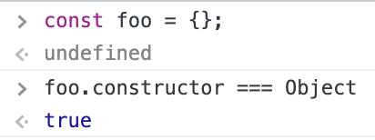
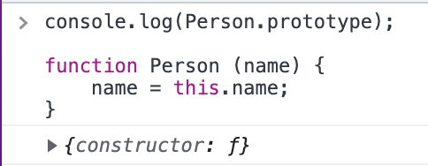

# 19. 프로토타입

**js는 프로토타입으로 상속을 구현한다.**

- 상속 : 객체지향의 핵심 개념으로 다른 객체의 프로퍼티와 메서드를 이어받아 사용하는 것

상속은 어떠한 개념으로 js에서는 프로토타입이라는 방법으로 이 개념을 구현한다. 프로토타입은 어떠한 객체로 생성자 함수의 prototype 프로퍼티에 바인딩 되어있다. 즉, 생성자 함수와는 별개로 존재하고 있다.

프로토타입은 객체이므로 프로퍼티와 메서드를 가질 수 있으며 이것들은 해당 프로토타입과 연결되어 있는 생성자 함수가 생성하는 인스턴스들이 상속받아서 사용할 수 있다. (정확히 어떻게? 라는 질문은 뒤에서 해결)

## [[prototype]]

모든 객체는 [[prototype]] 내부 슬롯을 가지며 이 값은 프로토타입 객체의 참조다. 내부 슬롯이므로 직접 접근은 불가능 하지만 `__prototype__` 접근자 프로퍼티로 간접 접근할 수 있다. 따라서 생성자 함수, 프로토타입 객체, 인스턴스는 연결되어 있다

- 생성자 함수의 prototype 프로퍼티가 프로토타입을 가리킨다.
- 프로토타입의 constructor 프로퍼티가 생성자 함수를 가리킨다.
- 인스턴스의 `__prototype__` 가 프로토타입을 가리킨다.

하지만 직접 상속으로 `__prototype__` 을 사용할 수 없는 경우도 있어 `__prototype__` 을 사용하는 것은 권장되지 않는다. 그 대신 `__prototype__` 접근자 프로퍼티의 get, set을 사용하기 위해서 다음과 같은 방법이 권장된다.

```js
const obj = {};
const parent = {x : 1};

Object.getPrototypeOf(obj); // `__prototype__` 의 get 메소드를 대신한다.
Object.setPrototypeOf(obj, parent); // `__prototype__` 의 set 메소드를 대신한다.
```

## 객체 리터럴 표기법에 의해 생성된 객체

위에서는 생성자 함수의 경우를 다루었다. 프로토타입의 constructor 는 해당 프로토타입을 상속받는 인스턴스를 생성한 생성자 함수를 가리킨다.  
만약 객체 리터럴로 생성자 함수 없이 객체를 생성한다면 이 경우에도 같게 동작할 것인가?

ECMA 표준에 따르면 생성자 함수 호출과 리터럴의 평가는 추상 연산 OrdinaryObjectCreate 를 호출하는 것은 동일하지만 세부 사항 몇 가지가 다르며 결론은 리터럴로 생성된 객체는 **Object 생성자 함수가 생성한 것이 아니다.**  

하지만 리터럴로 생성한 객체가 프로토타입으로 부터 상속받은 constructor 프로퍼티를 확인해 보면 Object 와 연결되어 있다.



리터럴로 생성한 객체도 상속을 위해서 프로토타입이 필요하기 때문에 그 프로토타입과 쌍을 이루는 (가상의) 생성자 함수가 필요하다. 그래서 결론은 어떤 방식으로 생성하든 객체는 다 동일한 특성을 가지고, 따라서 위의 예제처럼 **constructor 가 가리키는 생성자 함수를 리터럴을 생성한 생성자 함수로 생각해도 크게 무리는 없다는 것이다.** (실제로는 그렇게 생성하지 않았지만!)

## 프로토타입의 생성 시점

프토토타입 객체는 생성자 함수가 생성되는 시점에 같이 생성된다.

따라서 사용자 정의 생성자 함수의 경우 함수 선언문으로 함수를 선언하면 런타임 이전에 함수 선언문이 평가되어 함수 객체를 생성하고 이 때 프로토타입도 같이 생성된다.  



반면 함수 표현식은 값이 할당문이 실행되는 런타임에 평가된다.


빌트인 생성자 함수는 전역 객체 생성 시점에 생성되므로 빌트인 생성자 함수와 연결되어 있는 프로토타입도 그러하다.

## 생성 방식에 따른 프로토타입의 결정

## 프로토타입 체인

앞에서 객체는 자기가 상속받은 프로토타입의 메서드나 프로퍼티를 사용할 수 있다고 하였는데 프로토타입 체인은 **그럼 그 상속을 어떻게 하는 것인가?**에 대한 답변이다.  
js의 객체는 객체의 프로퍼티 / 메서드에 접근할 때 해당 객체에 접근하려는 프로퍼티가 없으면 [[prototype]] 내부 슬롯의 참조를 따라서 프로토타입의 프로퍼티를 검색하게 되는데 이것이 프로토타입 체인이며 이것이 상속을 구현하는 방식이다.

접근하려는 프로퍼티가 없으면 [[prototype]] 내부 슬롯에 바인딩 되어 있는 프로토타입 객체로 이동하여 접근하려는 프로퍼티를 검색하고, 만약 거기에도 없으면 검색을 했던 해당 프로토타입 객체의 [[prototype]] 내부 슬롯에 바인딩 되어있는 프로토타입 객체로 이동하여 또 검색하고... 

나올 때까지 검색하며 만약 체인의 종점인 Object.prototype([[prototype]] 의 값이 null임)에서도 찾을 수 없을 경우 undefined를 반환한다. (이때 오류 발생하지 않음)

## 오버라이딩

