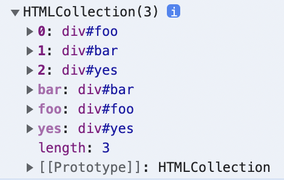

# 38. 브라우저의 렌더링 과정

## 요청과 응답

브라우저의 핵심 기능은 서버에 리소스롤 요청하고 응답받아 그 리소스를 파싱하여 렌더링 하는 것에 있다.

- 파싱 : 텍스트 문자열을 문법 기본 요소인 토큰으로 분해하고, 의미와 구조에 따라 트리 구조인 파스 트리를 생성하는 과정을 말한다.
- 바이트코드 : 파스 트리를 기반으로 만든 가상 머신에서 실행가능한 코드이다.
- 렌더링 : 파싱의 결과를 브라우저에 시각적으로 출력한다.

단계별로 살펴 보자면 먼저 서버에 리소스를 요청하기 위해서 주소창이 제공된다. 주소청에 URL을 입력하면 호스트 이름이 DNS를 통해 IP 주소로 변환되고 이 주소로 서버에게 요청을 하게 된다.

- URL : 웹에 게시된 리소스를 찾기 위한 주소
- 호스트 이름 : 네트워크에 연결된 장치(컴퓨터)의 이름, 도메인이라고도 한다.
- DNS : 사람이 읽을 수 있는 도메인을 IP 주소로 바꾸어 준다.
- IP : Internet Protocol 의 약자로 네트워크에서 정보를 교환하기 위한 규약을 의미한다. 이 통신에 필요한 고유 번호를 IP 주소라고 한다.

이러한 방식으로 브라우저는 서버에 정적 파일이나 동적 데이터를 요청할 수 있다.

## HTTP 1.1 / HTTP 2.0

HTTP 란 웹에서 브라우저와 서버 사이의 통신을 위한 규약이다. 대표적으로 1.1과 2 버젼이 있다.

- 1.1 에서는 한 커넥션에서 하나의 요청과 응답만 처리할 수 있어서 리소스 요청(css,img,js등)과 응답이 개별적으로 전송되므로 요청 개수가 많아지면 응답시간도 증가한다.
- 2 에서는 한 커넥션에서 다중 요청/응답이 가능해 여러 리소스의 동시 전송이 가능하여 1.1 보다 페이지 로드가 더 빠르다.

## HTML 파싱

서버에 요청한 결과로 HTML을 응답받게 되면 렌더링을 위해서 단순한 문자열인 HTML을 브라우저가 이해할 수 있는 자료구조로 바꾸어서 저장해야 한다. 이때 파싱의 결과로 만들어진 트리 자료구조를 DOM이라고 한다.

1. html 파일을 요청받으면 서버는 2진수로 응답한다.
2. 브라우저는 응답한 2진수 html 파일을 저장된 인코딩 방식에 따라서 문자열로 변환한다.
3. 문자열로 변환된 html을 문법적 최소 의미를 가지는 토큰으로 분해한다.
4. 토큰을 객체로 변환하여 노드로 만든다.
5. html의 중첩 관계를 반영할 수 있도록 노드들을 트리 자료구조로 구성한다. 이것이 DOM

## CSS 파싱

html을 순차적으로 파싱하여 DOM을 만들다가 CSS를 로드하는 link, style 태그를 만나면 DOM 생성을 일시 중지하고 서버에 해당 css 파일을 요청한 뒤, 응답으로 받은 css 파일을 html 와 같은 방법으로 파싱하여 CSSOM을 생성한다. CSS 또한 상속 관계를 가지고 있으므로 이를 반영한 트리 구조를 가지게 된다.

## 렌더 트리

응답으로 받은 html과 css를 파싱하여 DOM과 CSSOM이 만들어 졌다면 렌더링을 위해서 이 둘을 결합한 렌더 트리를 생성한다.  
렌더 트리는 각 html 요소의 **레이아웃**을 계산하는데 사용되며 브라우저 화면에 픽셀을 렌더링하는 **페인팅** 처리에 입력된다.

```
HTML - DOM - 렌더 트리 - 레이아웃 - 페인트
CSS - CSSOM ⤴
```

js에 의한 노드 추가 / 삭제, 브라우저 창의 리사이징 등 html 요소의 변동해 의해서 보이는 것이 달라지게 되는 경우에는 렌더링 과정이 반복될 수 있다. 이것은 비용이 많이 드는 작업이므로 가급적 발생하지 않도록 하는 것이 좋다.

## 자바스크립트 파싱과 실행

html 파싱 중 css를 로드하는 경우와 마찬가지로, script 태그를 만나면 js 코드를 파싱하기 위해 DOM 생성을 일지 중지하고 렌더링 엔진에서 js 엔진으로 제어권이 이동한다. 제어권을 받은 js 엔진은 js 코드를 해석하여 추상적 구문 트리 (AST)를 생성한다. 그리고 AST를 기반으로 인터프리터가 실행할 수 있는 코드인 바이트코드를 생성하여 실행한다.

## 리플로우와 리페인트

DOM은 이미 생성된 DOM을 조작할 수 있는 DOM API를 제공한다. 만약 js에서 DOM API가 사용된 경우 DOM이나 CSSOM이 변경되므로 변경된 내용으로 렌더 트리가 다시 결합되고 그 기반으로 레이아웃 - 페인트 과정이 다시 실행되어 브라우저에 최종 렌더링 된다. 이 것을 리플로우, 리페인트 과정이라고 한다.

리플로우는 레이아웃(위치나 크기)에 영향을 주는 경우에만 실행된다. 따라서 레이아웃에는 변동 사항이 없는 경우에는 리플로우 없이 브라우저 화면에 픽셀을 다시 렌더링하는 리페인트만 실행된다.

## HTML 파싱 중단

html 파싱은 위에서부터 순차적으로 진행되며, 또한 동기적으로 진행되므로 중간에 자바스크립트 파싱을 해야 하는 경우 DOM 생성이 중지되고 js 파싱이 끝날 때까지 기다렸다가 다시 DOM 생성이 시작된다. 즉 script 태그는 html 파싱을 블로킹한다.

또한 script 태그 내에서 아직 생성되지 않은 DOM의 요소를 조작하는 경우에는 문제가 발생할 수 있다.  
따라서 js를 body 요소의 최하단에 위치시키는 것이 좋다. 이 경우 다음과 같은 장점이 있다.

- js 파싱에 의해서 html 요소의 렌더링이 블로킹 되지 않아서 페이지 로딩 시간이 단축된다.
- 완성되지 않은 DOM을 js가 조작하여 에러가 발생하는 것을 막을 수 있다.

## async / defer

위와 같은 문제를 근본적으로 해결하기 위해서 HTML5에서 script 태그에 async / defer 어트리뷰트가 추가되었다.

해당 어트리뷰트는 외부 js파일을 로드하는 경우에만 사용할 수 있으며, script 태그에 인라인 js를 사용하는 경우에는 쓸 수 없다.

```html
<script async src="exam.js"></script>
<script defer src="exam.js"></script>
```

둘다 html 파싱과 외부 js 파일 로드를 비동기적으로 변경시켜주나, 차이점이 있다.

- async : 로드가 끝난 후 바로 파싱과 실행을 진행한다. 따라서 DOM이 완성되지 않았을 수도 있다. 다만 파일 로드만 비동기적으로 진행된다.
- defer : 로드가 끝난 후 DOM 생성이 완료된 직후에 파싱과 실행을 진행한다.

결국 로드만 비동기적으로 되고 파싱 자체는 어쩔 수 없네. 브라우저 제어권 자체가 렌더링 엔진에서 js엔진으로 넘어가기 때문일까.

# 39. DOM

DOM은 html을 파싱한 결과물로 html을 계층적 구조와 정보를 표현하며 이를 제어할 수 있는 DOM API를 제공하는 트리 자료구조이다.

## html 요소

html 요소는 html 문서를 구성하는 개별적인 요소이다.

```html
<div class="greeting">hello</div>
```

- <div> : 시작 태그
- class : 어트리뷰트 이름
- "greeting" : 어트리뷰트 값
- hello : 콘텐츠
- </div> : 닫는 태그

html 요소는 파싱의 결과로 DOM을 구성하는 요소 노드 객체로 변환된다. 이 때 어트리뷰트 (class="greeting")은 어트리뷰트 노트로, (텍스트) 콘텐츠는 텍스트 노드로 변환된다.

html의 요소 간에는 중첩 관계가 있다. 이러한 관계를 반영하여 DOM은 모든 노드 객체들을 트리 자료구조로 구성한다.

### 트리 자료구조

부모 노드와 자식 노드로 이루어져 계층 구조를 나타낼 수 있는 비선형 자료구조이다. 부모 노드가 없는 하나의 최상위 노드에서 시작하며 자식 노드를 가질 수 있다. 자식 노드가 없는 노드를 리프 노드라고 한다.

## 노드 객체의 타입

html 요소는 파싱되어 노드 객체로 변환된다고 하였다. 중요한 노드 객체 4가지를 알아보자.

- 문서 노드 : DOM 트리의 최상위 노드로서 브라우저가 렌더링한 html 문서 전체를 가리키는 객체인 document 객체를 가리킨다. 이 document는 전역 객체 window의 프로퍼티 document 에 바인딩 되어 있어 참조가 가능하다. html 문서 당 window는 유일하며 이 window에 바인딩 되어 있는 document 객체 또한 유일하다.
- 요소 노드 : html 요소를 가리키는 객체이다. 중첩에 의한 부자 관계를 가지고 있다.
- 어트리뷰트 노드 : html 요소의 어트리뷰트를 가리키는 객체이다. 어트리뷰트 노드는 요소 노드에 연결되어 있지만 부모 노드를 가지지 않는다. 따라서 어트리뷰트 노드에 접근 시 요소 노드에 접근을 먼저 해야 한다.
- 텍스트 노드 : html 요소의 텍스트를 가리키는 객체이다. 문서의 정보를 담고 있으며, 요소 노드의 자식 노드이자 자식 노드를 가질 수 없는 리프 노드이다. 이 또한 요소 노드에 먼저 접근해야 텍스트 노드에 접근할 수 있다.

## 노드 객체의 상속 구조

노드 객체는 ECMA 표준 사양이 아닌 빌트인 객체이다. 하지만 js의 객체이므로 프로토타입에 의한 상속 구조를 가진다.

```
Object - EventTarget - Node - Document - HTMLDocument
                            ㄴ Attr
                            ㄴ CharacterData - Text
                                            ㄴ Comment
                            ㄴ Element - HTMLElement - HTMLInputElement
                                                    ㄴ ...
```

모든 노드 객체는 Object - EventTarget - Node 인터페이스를 상속받는다.  
문서 노드는 Document - HTMLDocument를, 어트리뷰트 노드는 Attr, 텍스트 노드는 CharacterData, 요소 노드는 Element - HTMLElement - 종류별 추가 인터페이스를 상속받으며 자신의 프로토타입 체인에 있는 모든 메서드를 상속받아 사용할 수 있다.

체인의 상위에 갈 수록 노드 객체의 공통된 기능들을, 체인의 하위로 갈 수록 고유한 기능들을 배치하여 각 노드 객체에 필요한 기능을 상속하는 구조를 갖추었다.

# DOM

## 요소 노드 취득

html 요소의 조작은 요소 노드를 취득하는 것부터 시작된다. DOM은 이 작업을 지원하는 메서드들을 제공한다.

### id를 이용한 요소 노드 취득

Document.prototype의 메서드인 getElementById()는 id 어트리뷰트 값을 가지는 요소 노드를 탐색하여 반환한다.

```html
...
<li id="hello">greeting!</li>
...
<script>
  const $elem = document.getElementById('hello');
</script>
```

id 어트리뷰트 값은 html 문서 내에서 하나만 존재해야 하지만 그렇지 않더라도 오류는 나지 않는다. 따라서 getElementById는 해당 id 값을 가지는 **첫 번째 요소 노드**만을 반환한다. 존재하지 않는 경우에는 null을 반환한다.

html 요소에 id를 부여하면 id 값과 같은 이름의 **전역 변수**가 암묵적으로 생성되어 해당 노드 객체가 할당된다. 이것은 암묵적 전역으로 전역 객체에 프로퍼티가 생성되는 것과는 다르게 전역 변수가 생성되는 것이므로 delete로 지워지지 않는다.

```html
...
<li id="hello">greeting!</li>
...
<script>
  console.log(hello === document.getElementById('hello')); // true
</script>
```

다만 이미 id값과 동일한 전역 변수가 선언되어 있으면 노드 객체를 재할당하지는 않는다.

### 태그 이름을 이용한 요소 노드 취득

Document.prototype/Element.prototype.getElementByTagName 메서드는 태그 이름을 인수로 전달받아 해당 태그 이름을 가진 모든 요소 노드들을 탐색하여 반환한다. 함수의 반환값은 하나이므로 모든 요소 노드를 반환하기 위하여 요소 노드 객체를 유사 배열 객체이면서 이터러블인 HTMLCollection 에 담아서 반환한다.

```html
...
<div id="foo">apple</div>
<div id="bar">banana</div>
<div id="yes">orange</div>
<script>
  const $elems = document.getElementsByTagName('div');
  console.log($elems);
</script>
...
```

다음과 같은 결과.



모든 요소를 취득하고 싶다면 인수로 '\*'을 전달하면 되며 메서드의 탐색에 해당하는 요소 노드가 없는 경우 빈 HTMLCollection 객체를 반환한다.

getElementByTagName 메서드는 Document.prototype 과 Element.prototype 두 군데에 있는데, 사용 방법이 다르다.

Document.prototype.getElementByTagName는 document를 통해 호출하며 DOM 전체에서 탐색한다.  
반면 Element.prototype.getElementByTagName는 특정 요소 노드(를 먼저 취득한 다음에)를 통해서 호출하며, 해당 특정 요소 노드의 자손 노드 중에서 탐색한다.
