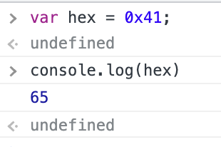
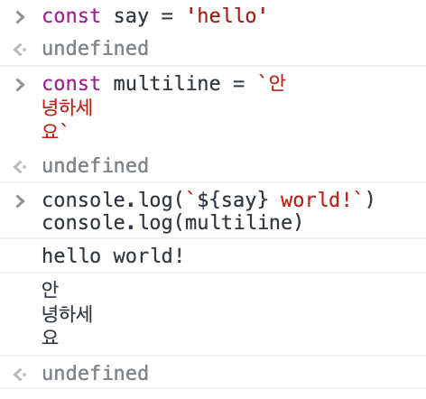

# ch04. 변수

## 변수

하나의 값을 저장하기 위해 확보한 메모리 공간 자체 또는 그 공간을 식별하기 위해 붙인 이름.

식별자(변수)는 값 자체가 아니라 값이 있는 메모리 주소를 기억하고 있다.
또한 식별자는 변수 이름에만 국한되지 않는다. 함수, 클래스의 이름도 식별자라고부른다,

## 선언과 호이스팅

변수 선언은 소스 코드가 위에서부터 차례로 실행되는 시점인 **런타임**에 이루어 지는 것이 아니라, 그 이전 단계에서 먼저 실행되므로 런타임에서 변수를 참조할 때 참조하는 코드가 선언하는 코드보다 위에 있어서 (이미 선언이 완료되었기 때문에) 참조를 할 수가 있다.

이렇게 변수 선언문이 코드의 제일 처음으로 끌어올려지는 것처럼 동작하는 js의 특성을 **호이스팅**이라고 한다.
변수 선언 뿐만 아니라 모든 선언문은 런타임 이전에 실행되므로 호이스팅이 적용된다.

## 할당

할당은 런타임에 실행된다. 따라서 선언 코드보다 참조 코드가 위에 있다면 호이스팅에 의해 참조는 가능하나 엔진에 의해 초기화된 undifined값을 받게 된다.

## 재할당

## 식별자 네이밍 규칙

주의점

- 대소문자는 서로 다른 것으로 구별된다.
- 변수는 의미를 명확히 표현해야 한다.
- 일반적으로 변수 함수에는 카멜 케이스, 생성자 함수와 클래스는 파스칼 케이스를 사용한다.

# ch05. 표현식과 문

여기서 나오는 용어들이 계속 쓰인다! 이 부분이 헷갈리게 되면 뒤쪽 내용을 읽는게 이해가 잘 안되고 버벅여서 다시 보는 중이다.
대충 무슨 말인지는 알겠는데 정확히 설명해봐라고 한다면 곤란하네

## 값

값은 표현식이 평가되어 생성된 결과를 말한다.

## 리터럴

리터럴은 사람이 이해할 수 있는 문자나 약속된 기호로 값을 생성하는 표기법을 말한다.
즉 js 엔진은 런타임에 리터럴을 해석해 (평가해) 값을 생성한다.

## 표현식

표현식은 값으로 평가될 수 있는 문이다. 두 가지 방법이 있는데 값을 생성하거나 기존 값을 참조하는 것이다.
먼저 리터럴은 값을 생성한다고 했으므로 (= 값으로 평가될 수 있으므로) 표현식이다.

```js
100; // 리터럴이므로 표현식이다.
var score = 50 + 50; // 50 + 50 은 평가되어 값 100을 생성하므로 표현식이다.
score; // 변수 이름(식별자)를 참조하면 변수 값으로 평가된다. 즉 100이라는 값으로 평가되므로 표현식이다.
```

또한 표현식과 값은 동치이다. 즉 값이 들어가는 자리에는 표현식으로 바꾸어 쓸 수 있도 그 반대도 성립한다.

## 문

먼저 토큰은 문법적인 의미의 최소 단위라고 할 수 있다.
여러 토큰이 모여 최소 실행 단위를 만들면 문이라고 부른다. 문이 모여서 프로그램이 된다.

## 표현식인 문과 표현식이 아닌 문

즉 모든 표현식은 문이지만, 모든 문이 표현식인 것은 아니다. (문이 더 넓은 개념)
선언문은 값으로 평가되지 않으므로 표현식이 아닌 문이며 할당문은 표현식인 문이다.

구별할 수 있는 방법은 두 가지가 있는데 변수에는 값을 할당하기 때문에 값에 할당이 가능하다면 값으로 평가되는 (=값과 동치인) 표현식인 문이다.

또한 크롬 개발자 도구에서 표현식이 아닌 문은 undefined, 표현식인 문은 평가된 값을 반환한다.

# ch06. 데이터 타입

js는 number, string, boolean, undefined, null, symbol의 여섯 가지 원시 타입과 객체 타입 총 7개의 데이터 타입을 제공한다.

## number

64비트 부동소수점 형식을 따른다. js는 숫자를 나타낼 수 있는 타입이 number 하나이므로 모든 수가 실수로 처리된다.  
또한 값을 참조시 10진수로만 해석된다. (2,8,16진수로 작성은 가능)



- [ ] 부동소수점에 대해서 공부하기

## string

작은 따옴표, 큰 따옴표, 백틱으로 감싸서 표현한다.

### 템플릿 리터럴

es6에서 도입된 새로운 문자열 표기법으로 몇 가지 문자열 처리 기능을 쉽게 쓸 수 있게 해주며 런타임에 일반 문자열로 변환 처리된다.

백틱``을 이용해서 표현하면 되며 표현식 삽입과 멀티라인을 지원한다.  
다음과 같이 사용할 수 있다.



## boolean

각각 참과 거짓을 나타내는 true와 false뿐이다.

## undefined

undefined 타입의 값은 undefined 하나 뿐이다. js 엔진이 변수를 초기화 할 때 부여하는 값으로 개발자의 의도적 사용은 권장되지 않는다고 한다.

## null

null 타입의 값은 null 하나 뿐이다. 변수에 아무 값도 없다는 것을 드러내고 싶을 때 undefined가 아닌 null이 사용된다.

## symnol

es6에서 추기된 타입으로 다른 값과 중복 되지 않는 유일무이한 값으로 객체 프로퍼티 키를 만들 때 사용된다고 한다. 뒤에 33장에서 다뤄준다고 한다.

## 객체

원시 타입과는 근본적으로 다른 타입으로 js를 구성하는 대부분이 객체 타입이다. 대충 보니 11장 이후로는 전부 객체에 관련한 이야기 들이다.

## 데이터 타입의 필요성

- 값 저장시 확보할 메모리 공간의 크기를 정하기 위해서
- 값 참조시 읽어들일 메모리 공간의 크기를 정하기 위해서
- 메모리에서 읽어들인 2진수를 어떻게 해석할지를 결정하기 위해서

## 동적 타이핑

C나 java 같은 언어는 변수 선언시 변수에 할당할 데이터 타입을 정해야 하는 정적 타입 언어이다.
js는 이와 다르게 선언만 했을 때는 타입을 가지지 않고 아는 어떤 값을 할당하느냐에 따라 변수 타입이 유동적으로 바뀌는 동적 타입언어이다.

이는 편리함과 유연한 프로그래밍을 가능케 하지만 변수 값과 타입의 변화를 추적하기가 힘들고 js 엔진에 의해 암묵적으로 타입이 바뀌는 경우도 있는 등 단점또한 존재한다. 이러한 문제를 줄이기 위해서 개발자가 할 수 있는 몇가지가 있음.

- 변수를 남발하지 않고 꼭 필요한 경우에만 쓴다.
- 변수의 스코프를 최대한 좁게 만들어야 한다
- 전역 변수를 사용하는 것을 최대한 피해야 한다.
- 변수보다는 상수를 사용한다.
- 변수는 의미를 잘 표현하도록 이름을 잘 이어야 한다.

## ch07. 연산자
