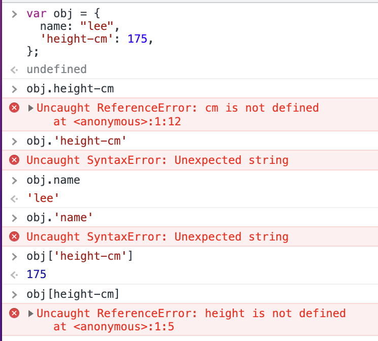
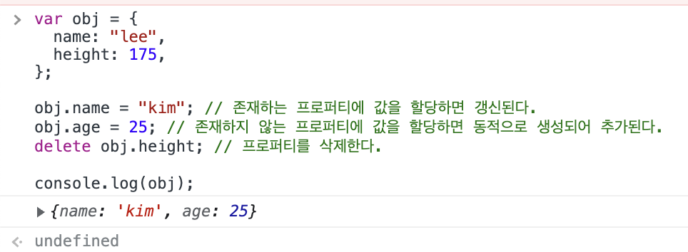

# ch10. 객체 리터럴

## 객체

0개 이상의 프로퍼티로 구성된 집합, 프로퍼티는 키와 값으로 구성된다.  
js의 모든 값은 프로퍼티가 될 수 있으며 특히 프로퍼티가 함수일 때 이 함수를 메서드라고 부른다.

## 객체 리터럴

객체 생성에는 여러가지 방법이 있고 가장 일반적이고 쉬운 방법은 객체 리터럴을 사용하는 것이다.  
{} 내에 프로퍼티를 정의하며 변수 할당시에 객체가 생성된다.  
객체 리터럴의 {}는 코드 블록이 아니고 표현식이므로 세미콜론을 붙인다.

## 프로퍼티

객체는 프로퍼티의 집합이다. 프로퍼티는 키와 값으로 구성된다.

- 키 : 문자열 또는 심벌 값
- 값 : js에서 사용하는 모든 값

문자열로 키를 쓸 때는 따옴표로 묶어야 하지만 식별자 네이밍 규칙을 따르는 경우에는 따옴표를 생략할 수 있으며 식별자 네이밍 규칙을 준수하는 것이 권장된다.  
같은 이름의 키를 중복 선언시 나중의 것으로 덮어써진다.

## 메서드

## 프로퍼티 접근

- . 를 사용하는 마침표 표기법
- [] 를 사용하는 대괄호 표기법

마침표 표기법을 사용하는 경우 프로퍼티 키를 따옴표 없이 써야 한다. 대괄호 표기법을 사용하는 경우 프로퍼티 키를 따옴표로 감싸야 한다.
따라서 식별자 네이밍 규칙을 지키지 않은 키는 따옴표로 감싸져 있을 것이므로 대괄호 표기법으로만 접근할 수 있다.



## 갱신, 동적 생성, 삭제



## ES6에서의 확장 기능

### 프로퍼티 축약

프로퍼티 값으로 변수를 사용하고 변수 이름과 프로퍼티 이름이 동일할 때 키값을 생략할 수 있다.

```js
var x = 1;
var y = 2;

// 다음 두 예제는 같은 형식의 객체를 만든다.
var obj = { x: x, y: y };
var obj2 = { x, y };
```

### 계산된 프로퍼티 이름

문자열 또는 문자열로 평가되는 표현식을 []로 묶어 프로퍼티 키를 동적으로 생성하는 것을 계산된 프로퍼티 이름이라고 한다.
ES6에서는 객체 리터럴 내부에서도 이 방식으로 생성이 가능해졌다.

### 메서드 축약 표현

메서드 정의시 함수의 function 키워드를 생략해 쓸 수 있다.

```js
const obj = {
  name: "kim",
  say() {
    // function 키워드 생략
    console.log(`hello`);
  },
};
```

# ch11. 원시 값과 객체의 비교

식별자는 문자열이 저장된 메모리 공간의 첫 번째 메모리 셀 주소를 가리킨다고 되어있다.

- [ ] 이것은 마치 문자열을 변수에 저장하는 방식이 객체와 같은 방식이라는 뜻이 맞는건지?

## 값에 의한 전달

원시 값이 복사되어 전달된다. 중요한 점은 각 식별자가 가리키는 메모리 주소는 다르다는 것이다. 따라서 한 쪽을 변경해도 다른 쪽에 영향을 주지 않는다. (서로 다른 메모리 공간에 저장되어 있으니까)

~ 하지만 이 메모리 주소에는 원시값이 아닌 객체를 가리키는 메모리 주소가 들어있다. 따라서 두 식별자가 가리키는 메모리 주소는 다르지만, 두 주소에서 참조하는 메모리 주소 값이 같기 때문에 같은 객체를 가리키게 된다. 따라서 한 쪽에서 변경하면 다른 쪽에서도 영향을 받는다.
