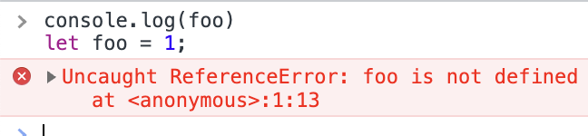
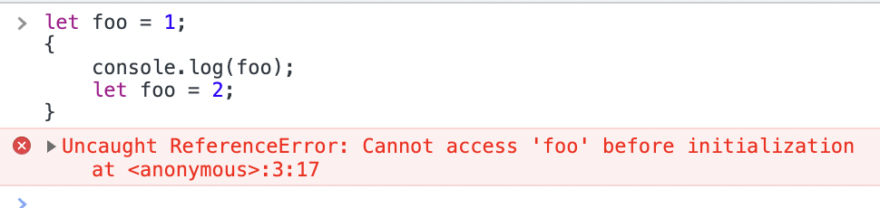

# ch12. 함수

## 함수

일련의 과정을 문으로 구현하고 코드 블록으로 감싸서 하나의 실행 단위로 정의한 것이라고 한다.
입력으로 전달받는 변수를 매개변수, 실제 입력을 인수, 출력을 반환값으로 부른다.

- [ ] 다 읽긴 했는데 정리를 못했네, 많다 많아 🥵

# ch13. 스코프

모든 식별자는 자신이 선언된 위치에 의해서 자신을 참조할 수 있는 범위가 결정되는데 이것을 스코프라고 한다.  
또한 js 엔진이 같은 이름의 변수가 여러 개 있다면 그 변수를 참조할 때 그 중 어느 것을 참조해야 할 지 결정할 때도 스코프가 사용된다.  
(근데 스코프가 없었다면 애초에 저런 결정을 할 일이 없었을테니까 좀 오묘하네)

어쨋든 스코프에 따라서 같은 이름의 변수를 여러 개 만들수 있는 편리함이 있다.

## 종류

코드의 가장 바깥 영역인 전역에 변수를 선언하면 전역 스코프를 가지는 전역 변수가 되고 어디서든 참조가 가능하다.
함수 몸체 내부에 변수를 선언하면 지역 스코프를 가지는 지역 변수가 되고 선언된 지역과 하위 지역 (중첩 함수의 내부)에서만 참조가 가능하다.

## 스코프 체인

함수 몸체 내부는 지역이고 지역에서 함수를 정의할 수 있다. 따라서 함수처럼 지역 스코프 또한 중첩되어 존재할 수 있으며 계층적인 구조를 가지게 된다.  
이렇게 소코프가 계층적으로 연결된 것을 스코프 체인이라고 한다.

중첩 함수의 스코프는 외부 함수의 스코프를 상위 스코프로 가지며 모든 지역 스코프의 최상위에는 전역 스코프가 존재한다.

js 엔진은 변수를 참조할 때 스코프 체인을 통해 변수 참조를 하는 하는 코드의 스코프에서 시작하여 상위 스코프로 이동하면서 선언된 변수를 검색한다.  
전역에 (외부)함수가 선언되었고 함수 내에 중첩 함수가 선언되었다. 이 중첩 함수에서 어떤 변수를 참조한다면,

- 먼저 중첩 함수의 지역 스코프 내에서 변수를 검색한다. 있으면 참조 후 검색을 종료한다.
- 없다면 중첩 함수의 지역 스코프의 상위 스코프인 외부 함수의 지역 스코프 내에서 변수를 검색한다. 있으면 참조 후 검색을 종료한다.
- 여기도 없다면 외부 함수의 지역 스코프의 상위 스코프인 전역 스코프에서 변수를 검색한다.

이와 같은 방식에서 알 수 있듯이 상위 스코프에서 선언된 변수는 하위 스코프에서 참조할 수 있지만 그 반대는 불가능하다.

변수 뿐만 아니라 모든 식별자가 같은 방식으로 검색한다.

## 함수 레벨 스코프

지역 스코프는 함수 몸체 내부라고 하였다. 즉 지역 스코프는 함수에 의해서만 생성이 되기 때문에, js의 var 변수는 함수 이외의 코드 블록에서는 지역 스코프를 생성하지 않는다.

예컨대 if문 안에서 var변수를 선언해도 이는 전역 변수가 된다. 이는 여러가지 불편함이나 문제를 발생시키기 때문에,  
(다른 프로그래밍 언어들처럼) 블록 레벨 스코프를 지원하는 let, const가 es6에서 도입된다.

## 렉시컬 스코프

- 함수를 호출한 위치에 다라서 상위 스코프를 결정한다.
- 함수를 정의한 위치에 따라서 상위 스코프를 결정한다. (js)

두 번째 방식을 렉시컬 스코프라고 부르며 js를 포함하여 대부분의 프로그래밍 언어들이 렉시컬 스코프를 따른다고 한다.

# ch14. 전역 변수의 문제점

## 변수의 생명 주기

변수는 선언시 생성되고, 할당을 통해 값을 가진다. 그리고 변수가 등록된 스코프가 소멸될 때까지 유효하다. 이것을 변수의 생명 주기라고 한다.  
자바스크립트에서 지역은 함수 몸체 내부를 말한다. 함수 내에 선언된 지역 변수는 함수가 호출되면 그 때 함수 내에서 먼저 선언문들이 실행되고(따라서 스코프 내에서 호이스팅이 발생), 선언된 변수들은 해당 함수가 생성한 지역 스코프에 등록된다.
이후 함수 내부의 코드가 실행되고, 일반적으로 함수가 종료되면 스코프도 소멸되므로 해당 지역 변수는 함수가 소멸할 때 까지 유효하다.  
이후 더 이상 아무도 참조하지 않으면 가비지 콜렉팅의 대상이 된다.

이와 달리 전역으로 선언한 변수는 진입점이 없으며 전역 객체의 프로퍼티고 되며 코드 로드시 바로 실행된다. 그리고 전역 객체가 유효한 동안, 예컨대 브라우저에서는 창을 닫을 때까지 전역 변수도 유효하다. 이처럼 전역 변수는 생명 주기가 길다.

## 전역 변수의 문제점

이러한 전역 변수의 특성 때문에 문제점이 발생한다.

- 어디서든 참조와 할당이 가능하므로 가독성과 안정성이 떨어진다.
- 생명 주기가 길기 때문에 그 동안 메모리를 차지하고 있다.
- 스코프 체인의 종점에 존재한다. 따라서 전역 변수는 제일 마지막에 검색되므로 시간이 더 걸린다.
- 파일이 분리되어도 같은 전역 스코프를 공유하기 때문에 예상치 못한 결과를 가져올 수 있다.

## 사용 억제하기

이러한 이유로 반드시 사용해야 하는 것이 아니라면 전역 변수를 사용하지 않아야 한다. 이를 위한 몇 가지 방법들이 소개되었다.

- 즉시 실행 함수를 사용한다. 모든 코드를 즉시 실행 함수로 감싸면 모든 변수가 즉시 실행 함수의 지역 변수가 된다. (라이브러리에서 많이 사용한다고 함)
- 전역에 네임스페이스 역할을 할 객체를 생성하고 변수를 프로퍼티로 추가한다. (근데 이거는 왜 좋은거지?)
- 모듈 패턴 (ch24 참고)
- ES6 모듈을 사둉하면 파일 자체의 독자적인 모듈 스코프를 이용할 수 있어서 모듈 내의 var는 전역 변수도 아니고 window의 프로퍼티도 아니게 된다고 한다.

### ch15. let, const 키워드와 블록 레벨 스코프

ES5까지 유일하게 변수를 선언할 수 있었던 var는 다음과 같은 문제점이 있다.

- 중복 선언 가능, 이는 의도치 않은 부작용을 만들 수 있다.
- 함수 레벨 스코프만을 지원, 코드 블록 내에서도 전역 변수로 선언되기 때문에 전역 변수를 남발하기가 쉽다.
- 호이스팅, 가독성을 떨어뜨린리고 위에서 아래로 진행하는 프로그램 흐름에도 맞지 않다.

이러한 문제점들을 보완하기 위해서 ES6에서 변수 선언을 할 수 있는 새로운 let, const 키워드가 추가되었다.

## let

let은 var와 달리 다음과 같은 특징을 갖는다.

1. 중복 선언이 금지된다.
2. 블록 레벨 스코프를 따른다. 모든 코드 블록(함수, if, for, while, try/catch ...)을 지역 스코프로 인정한다.
3. 호이스팅이 '발생하지 않는 것'처럼 동작한다.
4. 전역에서 선언해도 window의 프로퍼티가 되지 않는다

호이스팅이 '발생하지 않는 것'처럼 동작한다는 것은 무엇일까?  
호이스팅은 식별자 선언이 마치 코드의 맨 앞에 끌어올려진 것처럼 동작하는 것을 의미한다.
let은 그렇지 않다는 것, 즉 어떤 변수의 참조가 선언보다 먼저 나오면 참조할 수 없다.

하지만 다음의 경우는 어떤가? 만약 let foo = 2;가 콘솔보다 나중에 실행되는 것이라면 foo는 전역 변수 1로 할당되어 있어 콘솔에 출력이 되어야 하는데 여전시 참조를 할 수가 없다.

이는 let이 선안과 초기화가 분리되어 진행되기 때문이다.  
var는 선언이 되면 런타임 이전에 해당 스코프에 변수의 존재가 선언되고 바로 undefined로 초기화가 된다. 따라서 선언 코드가 참조보다 뒤에 있어도 undefined로 참조를 할 수 있다. 이후 할당문이 있다면 할당 될 것이다.

하지만 let은 런타임 이전에는 선언만 하고 초기화가 되지 않고, let의 초기화는 변수 선언문에 도달했을 때 실행된다.

따라서 위의 예제에서 코드가 블록에 도달하면 let으로 선언한 foo는 블록 지역 스코프에 등록만 되고 초기화가 되지 않는다. 그 다음에 위에서부터 콘솔이 실행되면 아직 변수 선언문에 도달해 초기화가 되지 않은 상태이기 때문에 참조가 불가능하다.

이렇게 스코프 시작 부터 초기화 시작까지 변수를 참조할 수 없는 구간을 일시적 사각 지대라고 부른다고 한다.

## const

기본적으로 let과 유사하지만 다른 점들이 있다.

1. 선언과 동시에 초기화 해야 한다.
2. 재할당이 금지된다.
3. 변수 값 변경시 재할당으로 변수에 저장된 값을 바꾸는 원시 값을 const에 할당하면 변경이 불가능해 상수로 사용할 수 있다.
4. 객체는 값을 변경시 재할당이 아닌 해당 메모리의 값을 직접 수정하므로 const에 객체를 할당해도 여전히 객체의 값을 변경할 수 있다.

중복 선언 금지, 블록 레벨 스코프, 호이스팅이 발생하지 않는 것처럼 동작하는 특징들은 let과 같다.

안전한 프로그램 설계를 위해서 const를 사용하고 재할당이 꼭 필요한 경우 let을 사용한다. ES6을 쓴다면 var는 쓰지 말자.
