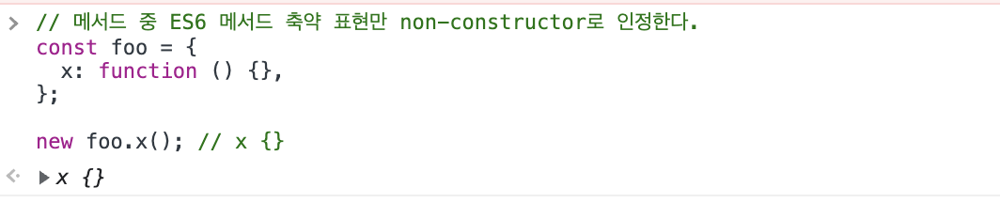
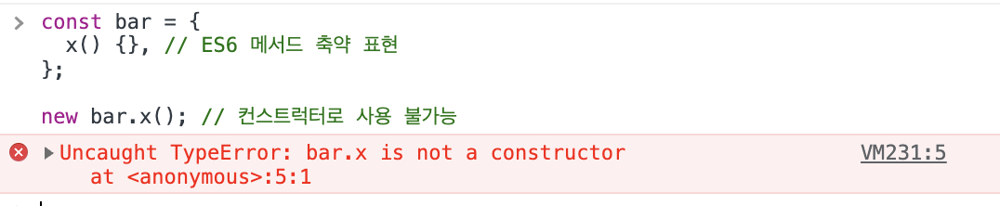
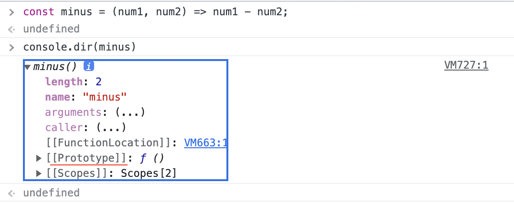

### 여기부터 복잡해지기 시작했다. 🥸

# ch16. 프로퍼티 어트리뷰트

### 내부 슬롯과 내부 메서드

내부 메서드와 내부 슬롯은 엔진 구현 알고리즘을 설명하는 것으로, 개발자가 접근할 수는 없다.  
원칙적으로 접근/호출은 불가능하나, 일부 내부 슬롯과 내부 메서드에 한해서 간접적으로 접근할 수단을 제공하기는 한다.

```
일단 내부 메서드는 '메서드'니까 함수다. 문서에서도 매개변수와 리턴값을 명시하고 있으므로 함수는 맞다고 생각되고,
그럼 메서드라고 이름 붙인 것은 이 내부 메서드를 담고 있는 객체가 있는 것인가? 그 객체가 내부 슬롯을 의미하는 걸까?
ECMAscript 문서를 읽어봐도 뭔가 잘 모르겠다...
```

### 프로퍼티 어트리뷰트와 프로퍼티 디스크립터 객체

프로퍼트 생성 시 엔진은 자동으로 프로퍼티 어트리뷰트를 정의한다.

- [[value]] : 값
- [[Writable]] : 갱신 가능 여부
- [[Enumerable]] : 열거 가능 여부
- [[Configurable]] : 재정의 가능 여부

이 프로퍼티 어트리뷰트는 내부 슬롯에 저장되어 있어서 직접 접근할 수 없지만 간접적으로 object.getOwnpropertyDescriptor는 위의 정보를 제공하는 객체를 반환하는데 이 반환값이 프로퍼티 디스크립터 객체이다.
object.getOwnpropertyDescriptors 메서드로는 해당 객체의 모든 프로퍼티의 프로퍼티 어트리뷰트를 반환한다.

## 데이터 프로퍼티, 접근자 프로퍼티

### 데이터 프로퍼티

키-값의 구성으로 되어있는 일반적인 프로퍼티이다. 위에서 본 4가지 어트리뷰트를 기본으로 가지고 있으며 프로퍼티 생성시 [[value]]는 프로퍼티의 값, 나머지 3개는 true로 초기화 된다.

### 접근자 프로퍼티

```
여기부터 시작 (get / set 정의하는 것까지 했음)
```

자체적으로 값을 가지지 않고 다른 프로퍼티의 값을 읽거나 저장할 때 쓰는 접근자 함수로 구성되어있다.

- [[get]] :
- [[set]] :
- [[Enumerable]] : 열거 가능 여부
- [[Configurable]] : 재정의 가능 여부

get/set을 정의할 때 쓰는 **이름**이 접근자 프로퍼티임. (get,set 단어가 붙어있어서 헷갈렸다) 그 뒤에는 함수가 나오고, 값은 가지지 않는다.

get : 접근자 프로퍼티에 접근하면 호출되는 함수. 즉 **객체이름.접근자프로퍼티명**으로 사용시 호출됨.

```js
// 예시
console.log(person.fullName);
```

set : 접근자 프로퍼티를 통해 값을 저장할 때 호출회는 함수. **접근자 프로퍼티의 값**을 설정하는 것이 아니다! 값은 데이터 프로퍼티에 저장된다.

```js
person.fullName = "jackson kim";
```

### 프로퍼티 정의

Object.defineProperty 메서드를 사용하면 프로퍼티 어트리뷰트를 정의할 수 있다.
데이터, 접근자 프로퍼티 둘 다(총 6종) 설정이 가능하다.

## 객체 변경 방지

객체는 기본적으로 (원시 값과는 달리) 재할당하지 않고 변경할 수 있다. js에서는 이를 막을 수 있는 메소드들을 지원한다.

### 객체 확장 금지

프로퍼티 추가가 금지된다. 동적 추가와 Object.defineProperty를 통한 추가를 할 수 없다.

```js
Object.preventExtensions(객체명);
```

### 객체 밀봉

프로퍼티 추가, 삭제, 프로퍼티 어트리뷰트 재정의(Object.difineProperty())가 금지된다. 읽기와 쓰기(갱신)만 가능하다.

```js
Object.seal(객체명);
```

### 객체 동결

프로퍼티 추가, 삭제, 갱신, 프로퍼티 어트리뷰트 재정의가 불가능 하다. 읽기만 가능하다.

```js
Object.freeze(객체명);
```

이 메소드들은 중첩 객체까지는 영향을 미치지 못한다.
즉 객체의 프로퍼티가 값으로 객체를 가지는 경우에 그 (값)객체는 동결이 불가능하다.

해결 방법으로는 Object.freeze를 재귀적으로 호출해야만 한다.

# ch17. 생성자 함수에 의한 객체 생성

## 생성자 함수

생성자 함수는 new 연산자와 함께 호출하여 객체를 생성하는 함수이다. 이렇게 생성된 객체를 인스턴스라고 부흔다.

```js
const person = new Object();
```

- [x] 생성자 함수 중에 String, Number 등이 있다. 그냥 숫자 타입과 Number 객체를 왜 또 만든거야? : 뒤쪽에 답이 있었다. 숫자 타입을 다룰 수 있는 유용한 메소드들을 제공하고 있기 때문이다. 이것은 ch28과 래퍼 객체에 대해서 공부하면 된다.

### 장점

객체 리터럴이라는 쉬운 방법이 있지만 생성자 함수로 객체를 생성하는 것의 장점이 있다.
같은 프로퍼티를 가지는 객체를 여러개 생성해야 하는 경우에 유용하다.

```js
function Circle(radius) {
  this.radius = radius;
  this.getDiameter = function () {
    return 2 * this.radius;
  };
}

const circle1 = new Circle(5); // 위에서 정의한 this는 이때 생성되는 객체를 (이미) 가리키고 있다.
const circle1 = new Circle(10);
```

### this

객체 자신의 프로퍼티, 메서드를 참조하기 위한 자기 참조 변수이다.  
위 예제에 this는 function 이라는 생성자 함수가 (미래에) 생성할 인스터스를 가리킨다.

| 호출 방식          | this                          |
| ------------------ | ----------------------------- |
| 일반 함수로 호출   | 전역 객체                     |
| 메서드로 호출      | 메서드를 호출한 객체          |
| 생성자 함수로 호출 | 생성자 함수가 생성할 인스턴스 |

생성자 함수는 일반 함수와 new 연산자가 없음녀 일반 함수로 '호출'된다.

## 인스턴스 생성 과정

1. 생성과 바인딩
   암묵적으로 빈 객체가 생성되고, this는 이 빈 객체에 바인딩된다. 이 절차는 런타임 이전에 실행된다.

2. 초기화
   함수 내부에 있는 코드가 실행되어서 인스턴스가 초기화 된다.
3. 반환
   모든 처리가 끝나면 완성된 인스턴스를 가리키는 'this'가 암묵적으로 반환된다.

## [[Call]]과 [[Construct]]

함수는 객체이므로 일반 객체가 가지고 있는 내부 슬롯과 메서드를 가지고 있고,  
추가로 함수의 기능을 구현하는 내부 슬롯과 내부 메서드를 가지고 있다.  
함수 호출시 호출되는 [[Call]]과 생성자 함수로 호출될 때 호출되는 [[Construct]]가 있다. (따라서 이 둘은 일반 객체에는 없다)

[[Call]] 이 있으면 callalbe, [[Construct]] 가 있으면 constructor라고 부른다.  
일반 객체는 둘 다 해당사항이 없을 것이고, 함수 객체는 호출이 가능하므로 반드시 callable이다.
하지만 함수 객체는 반드시 constructor인 것은 아니다.

- constructor : 함수 선언문, 함수 표현식, 클래스
- non-constructor : 메서드 축약 표현, 화살표 함수




## new

new 연산자와 constructor 함수를 호출하면 생성자 함수로 동작하고, new 연산자 없이 constructor 함수를 호출하면 함수 호출로 실행된다.
new가 있고 없고만 차이가 있을 뿐 일반 함수와 생성자 함수는 같은 문법을 쓰기 때문에, 구분을 위해서 생성자 함수는 첫 문자를 대문자로 하는 파스칼 케이스로 작성하여 구별할 수 있도록 하는 것이 바람직하다.

## new.target

파스칼 케이스를 도입해도 실수는 일어날 수 있다. 위와 같은 문제를 막기 위해서 new.target을 지원한다.  
new.targer은 new 없이 일반 함수로 호출되면 undefined가 되기 때문에 이를 생성자 함수 내부에서 확인할 수 있다.

```js
function Circle(radius) {
  // 파스칼 케이스. 생성자 함수로 쓸 함수이다.
  if (!new.target) {
    // 만약 new.target이 undefined라면 여기 if문에 걸려서 생성자 함수로 호출해 인스턴스를 반환한다.
    // 따라서 함수 밖에서 new가 있건 없언 생성자 함수로서 동작하는 논리
    return new Circle(radius);
  }
  // 함수 정의하는 부분
}
```

따라서 construct 함수를 new 없이 호출해도 생성자 함수로 쓸 수 있게 된다.  
Function, Object 생성자 함수는 이와 같은 원리인지는 모르겠으나(소개해놨으니 맞겠지?) 어쩃든 new 없이 호출해도 생성자 함수로 호출된다.  
다만 String, Number, Boolean등의 생성자 함수는 그렇지 않다.

- [ ] 왜일까?

# 18. 함수와 일급 객체

객체가 다음 조건을 만족하면 **일급 객체**라고 한다.

- 무명의 리터럴로 생성할 수 있다. // 무기명 함수 표현식으로 생성하면 됨
- 변수나 자료구조에 저장할 수 있다.
- 함수의 매개변수로 사용할 수 있다.
- 함수의 반환값으로 사용할 수 있다.

js에서 함수는 객체이며 또 일급 객체이다. 이말은 함수는 값으로 평가된다는 뜻이므로 값이 들어가는 곳에 모두 놓을 수 있다.
이렇게 유연한 함수의 동작은 함수형 프로그래밍을 가능케 하는 장점이라고 한다.

- [ ] 그런데 js에서의 객체는 다 저렇지 않나? 왜 일급 객체라고 이름을 따로 붙인거지? 다른 프로그래밍 언어에서는 다른가?

## 함수 객체의 프로퍼티

함수도 객체이므로 프로퍼티를 가지고, 또 호출가능한 특성이 있으므로 다른 객체들에게는 없는 고유한 프로퍼티를 가지고 있다.

### argument 프로퍼티

값으로 호출시 전달된 인수들의 정보를 담고 있는 유사 배열 객체를 가지고 있다. 즉 argument 객체의 프로퍼티의 값은 객체다.
이것은 함수 내부에서 지역 변수처럼 사용된다.

### caller

### length

함수 정의시 선언한 매개변수의 개수를 값으로 가진다.  
js는 매개변수보다 인자가 많아도 작동하고, 적어도 (부족한 인수는 undefined로 설정됨) 작동하기 때문에
argument 객체의 length 프로퍼티 값과 (유사 배열이므로 length가 있음) 함수 객체의 length(지금 설명하는 이것)이 다를 수도 있다.

### name

함수 이름을 나타낸다. 무기명 함수 표현의 경우 함수 객체를 가리키는 식별자를 값으로 가진다. (es6부터)

### prototype

prototype 프로퍼티는 constructor인 함수만이 가지고 있는 프로퍼티로 생성자 함수로 호출 될 떄 (미래에) 생성할 인스턴스의 프로토타입 객체를 가리킨다.

용어가 겹쳐서 이 부분이 헷갈리는데 잘 정리해 보자.

### **먼저 '프로토타입'은 무엇을 말하는가?**

js의 모든 객체는 [[Prototype]] 이라는 내부 슬롯을 가지고 있다. 이 내부 슬롯에 저장되는 객체를 '프로토타입 객체 (또는 프로토타입)'이라고 부른다.
그리고 이것은 내부 슬롯이기 때문에 직접적으로 조작은 불가능 하고 `__proto__` 접근자 프로퍼티로 간접적으로 접근이 가능하다.

이제 (constructor인) 함수를 생각하자.
이 또한 객체이므로 자신의 프로토타입을 가지고 있고, 이것에 `__proto__`로 접근할 수 있다.

한편 이 함수는 constructor 이므로 생성자 함수로 호출되어 객체를 생성할 수 있는데, 생성자 함수로 호출되어 새로운 객체가 만들어지면 이것도 객체이므로 자신의 프로토타입을 가지게 되고, 바로 이 프로토타입 객체를 가리키는 것이 생성자 함수의 prorotype 프로퍼티가 된다.

이러한 이유로 constructor인 함수는 prototype 프로퍼티를 가진다. 일반 객체는 그렇지 않다는 것을 볼 수 있다.


화살표 함수는 함수지만 non-constructor이므로 역시 prototype 프로퍼티가 없다. (하지만 객체이므로 당연히 [[Prototype]] 내부 슬롯은 있다.)



프로토타입에 대한 자세한 내용은 바로 다음 챕터부터 시작된다.
