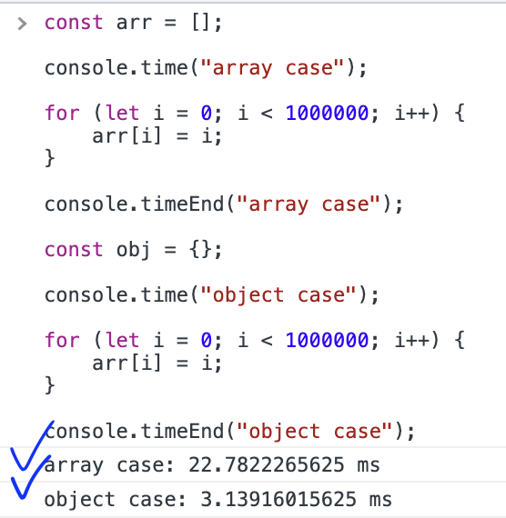
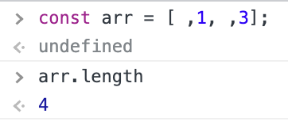

# ch27. 배열

배열은 여러 개의 값을 순차적으로 나열한 자료구조로 객체로 구현되어 있다.  
하지만 다른 객체와의 구별되는 특징이 있다.

- 프로퍼티 키/값 대신 인덱스와 요소라는 명칭을 사용한다. 값의 참조도 인덱스를 통해서 한다.
- 값의 순서가 의미가 있으며 length 프로퍼티를 가진다.

이러한 특징은 반복문을 통해 순차적인 값의 접근을 가능케 한다.

## 희소 배열

js의 배열은 동일한 크기의 메모리 공간이(따라서 요소가 하나의 데이터 타입을 가지며) 연속적으로 나열된 자료구조인 **밀집 배열**이 **아니라**, 요소가 저장되는 메모리 공간의 크기가 다를 수 있고, 연속적으로 이어져 있지 않을 수 있는 **희소 배열**이다.

따라서 js의 배열은 엄밀한 정의에 따른 배열이 아니라, 마치 배열처럼 동작하는 특수한 객체이다. 프로퍼티 키에 해당하는 것이 인덱스(문자열)이며, 프로퍼티 값이 사실은 배열의 요소인 것이다. js 객체의 프로퍼티 값은 js에서 사용할 수 있는 모든 값이 가능하므로, 배열 또한 그렇다. 이러한 구조 때문에 인덱스로 요소에 접근하는 것이 일반적인 배열보다 느리지만, 요소 삽입 / 삭제하는 경우에는 (일반 배열이었다면 요소를 삽입 / 삭제 함으로써 다른 요소들의 위치를 옮겨야 했던 일을 하지 않아도 되므로) 속도 면에서 유리하다.

이런 문제를 해결하기 위해서 js엔진은 최적화 과정을 거친다고 한다. 실제로 배열과 객체의 차이를 보려고 코드 실행 시간을 측정할 수 있는 console.time()을 이용해 보았는데 성능차이가 아주 많이 난다!

## length

length는 배열의 요소의 개수를 값으로 가지는 프로퍼티이다. 배열 생성 후 임의의 값으르 할당할 수도 있다. js는 배열의 요소가 일부 비어 있는 희소 배열을 허용하고 이 경우에 length와 요소의 개수가 일치하지 않는다. 희소 배열은 논리적으로도 배열의 개념과 맞지 않고 성능상의 문제로도 사용할 이유는 없다.

## 배열의 생성

# ch28. Number

표준 빌트인 Number 객체는 생성자 함수이다.
