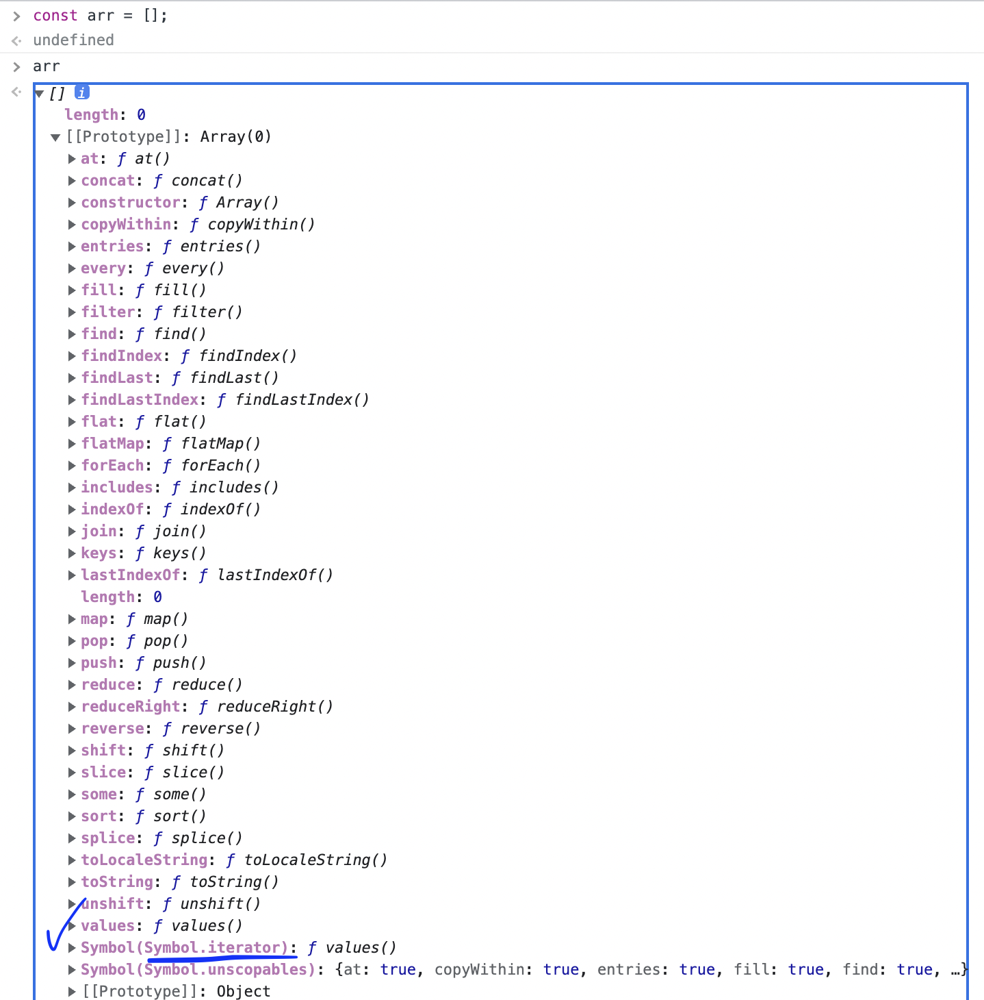
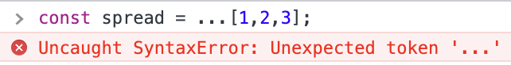

# ch33. Symbol

심벌은 ES6에서 추가된 원시 타입의 값이다. 특징으로는 다른 값과 중복되지 않는 유일한 값으로 프로퍼티 키를 겹치지 않게 생성하는데 주로 사용한다. (프로퍼티 키는 문자열 또는 심벌 값을 가진다.)

## 생성

다른 모든 원시 값들과는 달리 리터럴로 생성이 불가능하며 Symbol() 함수를 호출하여서 생성한다. 객체가 아닌 원시 값 생성이므로 new 연산자가 붙지 않는다. 이렇게 생성된 심벌값은 외부로 드러나지 않는다. 문자열을 인수로 전달 가능하나 부가 설명일 뿐 심볼 생성에는 관여하지 않는다. Symbol.prototype.description에 저장되는 듯 하다.


심벌 값은 숫자나 문자열 타입으로 암묵적 변환(예컨대 문자열 더하기 연산자의 피연산자로 써도)이 되지 않는다. 다만 불리언 타입으로는 변환이 되기 때문에 존재 확인이 가능하다.

## 메서드

- Symbol.for() : 검색 후 있으면 해당 심벌 값을 반환, 없다면 새로운 심벌 값을 생성하여 전역 심벌 레지스트리에 저장한 후, 반환한다.
- Symbol.keyFor() : 전역 심벌 레지스트리에 저장된 키를 얻을 수 있다.

## 프로퍼티 키

객체의 프로퍼티 키는 문자열 또는 심벌이 들어갈 수 있다고 하였다. 심벌 값으로 프로퍼티를 동적 생성하는 방법은 다음과 같다.

```js
const obj = {
  [Symbol.for("sym1")]: 1,
};

obj[Symbol.for("sym1")]; // 1
```

위의 예제처럼 키로 사용할 심벌 값을 []로 묶어야 한다. 접근시에도 마찬가지로 []로 묶는다.

이렇게 생성한 프로퍼티는 for ... in, Object.keys, Object.getOwnPropertyNames 메서드로 찾을 수가 없다. 이를 이용해 노출할 필요가 없는 프로퍼티를 숨길 수 있다. (다만 Object.getOwnPropertySymbols로 검색된다.)

## 표준 빌트인 객체 확장

일반 적으로 표준 빌트인 객체에 사용자가 메서드를 추가하는 것은 추후 버젼 업그레이드 시 메서드 이름이 중복될 수 있어 권장되지 않지만 심볼 값을 프로퍼티 키로 사용하여 메서드를 추가하는 경우 이런 경우에 대한 문제점을 막을 수 있다.

## Well-known Symbol

js가 기본으로 제공하는 빌트인 심벌 값을 **Well-known Symbol**이라고 한다. 이것들은 js 엔진의 내부 알고리즘 구현에 쓰인다.

# ch34. 이터러블

## 이터레이션 프로토콜

ES5까지의 js는 순회 가능한 데이터 컬렉션등은 각자 구조가 다르고 순회 방법도 달랐다. ES6에서는 이것들을 이터레이션 프로토콜을 준수하는 이터러블로 일원화하고 그것을 지원하는 기능을 추가 하였다.

### 이터러블

이 부분이 헷갈렸는데 정리해보면 '이터러블'은 어떠한 객체로, 그러면 객체가 어떻게 이터러블이 될 수 있는가?  
첫번째는 Symbol.iterator 메소드를 상속받으면 가능하다. 예컨대 배열은 Array.prototype으로 부터 해당 메소드를 상속 받는다.  
배열만 봤지만 빌트인 이터러블은 이런 식으로 작동할 것으로 생각된다.



또 하나의 방벅은 Symbol.iterator를 프로퍼티 키로 사용하는 메서드를 직접 구현한 객체는 이터러블이 된다.

두 방법중에 무엇을 사용하든 어떤 객체가 이터러블이 된다면 그 객체는 for ... of 문으로 순회가 가능하고 스프레드 문법과 배열 디스트럭처링 할당의 대상이 될 수 있다. 이런 식으로 이전에 제각각이었던 순회 가능한 데이터 컬렉션등을 하나로 묶어서 관리할 수 있게 한다는 것이 목적이라는 것이다.

### 이터레이터

이터레이터 또한 '객체'이다. 이 객체는 이터러블의 Symbol.iterator 메서드를 호출하면 반환되는 것으로, next 라는 메서드를 상속 받고 있다.


이 next를 호출할 때마다, 이터러블을 순회하면 순회한 값과 순회 완료 여부를 객체의 형태로 나타낸다.


이터레이터는 이터러블을 순회하는 역할을 하는 객체라고 이해하였다.

## 빌트인 이터러블

표준 빌트인 객체인 Array, String, Set, Map, TypedArray, arguments, DOM 컬렉션은 이터러블이다.

- [ ] 아니 근데 문자열은 왜 이터러블인가? 문자열은 객체가 아니라 원시 값인데, 생성자 함수 String 으로 생성된 인스턴스 말고 문자열 리터럴도 이터러블로 판단된다. 이터러블은 객체라고 했는데 왜 이런 거지? 아니면 문자열 래퍼 객체가 이터러블인 것이고 그래서 문자열을 이터러블이라고 하는 것인가?


## for ... of 문

이터레이터의 next 메서드는 호출되면 이터러블을 순회하면서 그 결과를 반환한다. 이것을 사용해서 이터러블을 순회하며 이터러블의 요소를 변수에 할당하는 for ... of 문이 작동한다.


## 유사 배열 객체

유사 배열 객체는 마치 배열처럼 인덱스로 프로퍼티 값에 접근할 수 있고 length 프로퍼티를 가지는 객체를 말한다. 따라서 for문으로 순회가 가능하며 js에서는 문자열, arguments 등이 있다.  
둘 다 순회가 가능하지만 이터러블과 유사 배열 객체는 서로 별개이다. 유사 배열 객체는 일반 객체이므로 for ... of 로 순회가 불가능하다. 하지만 유사 배열 객체이면서 이터러블인 것은 가능하다.

## 필요성

ES6에서는 이터레이션 프로토콜을 각자의 방식대로 순회를 하는 여러 데이터 컬렉션을 일원화하여서 효율적으로 사용할 수 있게 하기 위해서 도입되었다.

## 사용자 정의 이터러블

객체를 이터러블로 만들려면 두 가지 방법이 있다고 했다. 하나는 Symbol.iterator 메소드를 상속받거나 나머지 하나는 이터레이션 프로토콜을 준수하도록 구현하는 것이다. 두 번째 방법으로 사용자가 정의한 객체를 이터러블로 만들어 해당 객체를 스프레드 문법과 배열 디스트럭처링 할당의 대상이 될 수 있도록 만들 수 있다.

- [ ] 상세 내용 정리

# ch35. 스프레드 문법

ES6에서 도입된 스프레드 문법은 이터러블만 사용할 수 있다. 이터러블 앞에 ...을 붙여서 이터러블의 값들을 펼쳐서 개별적인 값의 목록으로 변환한다고 설명이 되어 있지만 펼친다거나 개별적인 값의 목록 같은 모호한 표현이 나오는데 왜냐하면 스프레드 문법의 결과물은 값이 아니기 때문에 변수에 할당할 수가 없다.



엥 그러면 이걸 어디에다 쓰냐라고 생각이 들지만 다음과 같은 문맥 안에서 사용한다.

- 함수 호출시 인수로 사용
- 배열 리터럴의 요소로 사용
- 객체 리터럴의 프로퍼티로 사용

## 함수 호출시 인수로 사용

함수 호출시 인수로 스프레드 문법을 적용한 이터러블을 넣으면 이터러블의 값 하나하나를 각각의 인수로 전달할 수 있다.


Rest 파라미터와 형태가 같으므로 주의해야 한다.

- Rest 파라미터 : 입력값은 인수들, 결과는 인수들의 목록을 요소로 가지는 배열이다.
- 스프레드 문법 : 입력값은 이터러블(배열과 같은), 결과는(값으로 반환하지 않지만) 개별적인 값의 목록이다. 따라서 어떻게 보면 정 반대의 일을 하고 있다고도 할 수 있겠다.

## 배열 리터럴의 요소로 사용

## 객체 리터럴의 프로퍼티로 사용]

# ch36. 디스트럭처링 할당

디스트럭처링 할당은 이터러블 또는 객체를 구조를 해체하여 1개 이상의 변수에 개별적으로 할당하는 것이다. 스프레드 문법은 이터러블만 (객체는 x) 사용가능하였지만 디스트럭처링 할당은 이터러블과 일반 객체 모두에서 작동한다.

# ch37. Set과 Map

## Set

Set은 객체이며 Set 생성자 함수로 생성된다. Set 생성자 함수는 이터러블을 인수로 전달받아서 Set 객체를 생성하며 생성된 Set 객체 또한 이터러블이다. 셋은 배열과 비슷한 형태를 띄나 몇 가지 다른 점이 있다.

- 요소의 값이 중복될 수 없다.
- 인덱스로 요소에 접근이 불가능하다.
- 요소 순서에 의미가 없다.

이름과 위에서 나열한 특징에서 알 수 있듯이 수학의 **집합**의 개념을 구현하기위한 객체이다.

## Map

Map은 키와 값의 쌍으로 이루어진 컬렉션이다. 객체와 유사하지만 몇 가지 차이가 있다.  
(말이 좀 헷갈리지만 주의할 것은 Map도 객체 타입이다.)


- 객체와 달리 키로 모든 값을 가질 수 있다.
- 객체와 달리 이터러블이다.
- 요소 개수를 확인하는 메소드가 다르다.

Map 생성자 함수는 이터러블을 인수로 받아서 Map 객체를 생성한다. 이때 생성된 Map 객체도 이터러블이다.ㄴ
