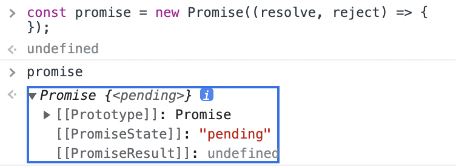
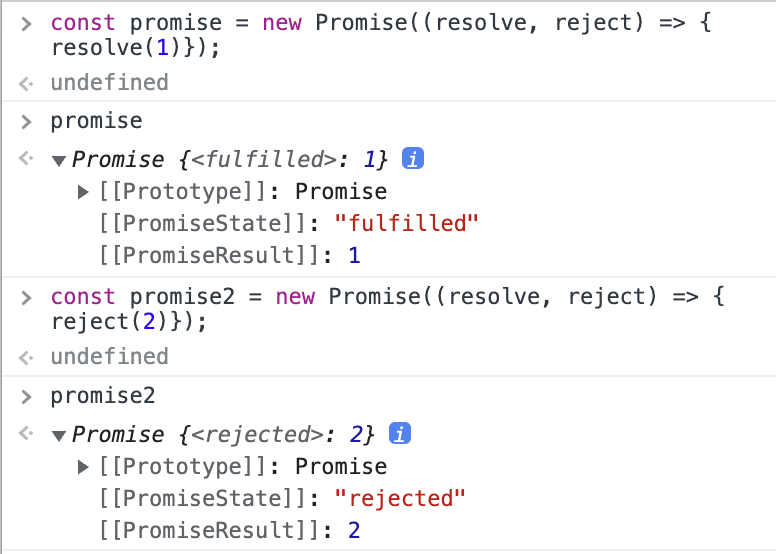

## 41. 호출 스케줄링

## 타이머 함수

양의 정수 timeoutID를 리턴하므로 해당 타이머를 식별할 수 있다.
이것을 clearTimeout의 인수로 전달하여 타이머를 취소할 수 있다.

```js
const timeoutId = setTimeout(func|code[, delay, param1, param2, ...]);

clearTimeout(timerId);
```

## 디바운스와 스로틀

# 42. 비동기 프로그래밍

먼저 비동기 프로그래밍이라는 것은 무엇을 의미하는 것인가?

현재 실행 중인 태스크가 종료할 떄까지 다음 태스크들이 대기하는 방식을 **동기 처리**라고 부른다.  
자바스크립트는 싱글 스레드로 동작하기 때문에 한 번에 하나의 태스크만 실행할 수 있다. 따라서 자바스크립트에서 동기 처리 방식으로 프로그래밍 하면 처리에 시간이 걸리는 태스크를 실행하는 경우 해당 작업이 종료될 때까지 다른 작업이 대기하게 되는 블로킹이 발생한다.

MDN 에서는 다음과 같은 예제를 보여준다. 시간이 오래 걸리거나, 또는 언제 완료될지 알 수 없는 작업이 중간에 있으면 뒷 작업이 모두 지연된다.

```js
const btn = document.querySelector("button");
btn.addEventListener("click", () => {
  // 버튼이 클릭되었을 때 작동할 이벤트를 등록, 'click' 메서드는 동기 처리 방식으로 동작한다.
  alert("You clicked me!");

  let pElem = document.createElement("p"); // alert을 닫은 뒤에야 실행
  pElem.textContent = "This is a newly-added paragraph."; // 이 문장은 그 후에서야 렌더링된다.
  document.body.appendChild(pElem);
});
```

이런 문제는 특히 외부의 리소스에 액세스하거나 가져오는 웹 기능에서 많이 문제가 된다. 이러한 응답은 오래 걸리기 때문에 (그리고 언제 응답이 올 지 알수 없고) 개발자는 응답이 올 때까지 기다리게 처리할 필요가 있다.

```js
let response = fetch("myImage.png");
let blob = response.blob(); // response가 언제 올 지 모름, 따라서 에러가 발생(할 확률이 매우 높음)
// display your image blob in the UI somehow
```

(위와 같은 문제들을 해결할 수 있도록) 현재 실행 중인 태스크가 종료되지 않아도

그렇담 js는 이 '비동기 프로그래밍'이라는 프로그래밍 방식을 어떻게 구현하는가? 전통적으로 콜백 패턴을 이용해서 구현한다.
setTimeout, setInterval, HTTP 요청, 이벤트 핸들러는

## 이벤트 루프와 태스크 큐

# 43. Ajax

Ajax는 js를 사용해 브라우저가 서버에게 비동기 방식으로 데이터를 요청하고,

# 45. 프로미스

프로미스는 js에서 비동기 처리를 위한 또 하나의 방법이다. 콜백 패턴이 가진 단점을 보완하기 위해서 ES6에서 도입되었다.

## 콜백 헬

## 프로미스 도입

Promise는 표준 빌트인 객체로 Promise 생성자 함수를 new 연산자와 함께 호출하여 프로미스(객체)를 생성한다.  
이 프로미스는 콜백 함수를 인수로 전달받는다.
이 콜백함수는 resolve, reject 함수를 인수로 전달받는다.

```js
const promise = new Promise((resolve, reject) => {
  // 비동기 처리를 수행할 코드를 여기에 작성한다.

  if (/* 비동기 처리 성공 */) {
    resolve('result');
  }
  else {
    reject('error');
  }
});
```

Promise()내의 콜백 함수 내에서 원하는 비동기 처리를 한다. 비동기 처리의 결과가 나올 때까지 기다리다가 성공하면 resolve(무엇이 성공을 의미하는 것인지는 직접 정해서 작성하는 것이다), 실패하면 reject를 호출한다.

위의 예제에서 **promise**는 Promise 생성자 함수에 의해서 생성된 객체(인스턴스)이다. 이 객체의 용도는 무엇일까??  
콘솔로 직접 살펴보았다. 일단 객체니까 [[prototype]] 내부 슬롯을 가지고 있다. 인스턴스의 [[prototype]] 생성자 함수의 프로토타입 객체를 참조하고 있을 것이기 때문에 Promise.prototype을 참조하고 있을 것이다. 오케이 이건 되었고 그 다음,  
[[PromiseState]] [[PromiseResult]] 내부 슬롯을 가지고 있다.



이것들의 용도는 무엇인가? 비동기 처리의 상태와 그 결과를 저장한다. 위의 그림처럼 해당 상태는 [[PromiseState]] = "pending"으로 초기화되어 있다. 이제 비동기 처리 성공 / 실패에 따라서 (무엇이 성공이고 실패인지는 직접 정해야 한다) resolve / reject 를 호출하면 그 호출의 결과로 [[PromiseState]] [[PromiseResult]] 내부 슬롯의 값이 변한다! 직접 예시를 보자.

성공시 (=resolve를 호출했을시) [[PromiseState]] 가 "fulfilled"로 바뀌고 [[PromiseResult]] 에 그 결과가 저장된다.  
실패시 (=reject를 호출했을시) [[PromiseState]] 가 "rejected"로 바뀌고 [[PromiseResult]] 에 그 결과가 저장된다.

- [ ] '그 결과'라는 것은 함수의 리턴값을 말하는 것인가?



결론 : 프로미스는 비동기 처리 상태와 결과를 저장하는 객체이다.

## 후속 처리

콜백 헬의 문제에서 보았듯이 프로미스에서도 비동기 처리 결과를 처리해야 할 필요가 있다.

### Promise.prototype.then

then 메서드는 두 개의 콜백 함수를 인수로 전달받는다.
첫 번째 콜백 함수는 fulfilled 상태(=resolve를 호출한 경우)에 호출되고, 두 번째 콜백 함수는 rejected 상태(=reject를 호출한 경우)에 호출된다. 따라서 둘다 호출되는 경우는 없다.

then 메서드는 언제나 프로미스를 반환한다고 되어있다. 이는 후속 처리에 후속 처리를 가능하게 하기 위해서 설계된 것으로 보인다.

### Promise.prototype.catch/finally

catch 메서드는 한 개의 콜백 함수를 인수로 전달받는다.
이는 rejected 상태에 호출된다.

finally 메서드는 프로미스 상태에 상관없이 전달받은 한 개의 콜백 함수를 실행한다.  
catch/finally 또한 프로미스를 반환한다.

- [ ] 각 후속 메서드가 반환한다는 프로미스

## 에러 처리

각 후속 처리 메서드 또한 프로미스를 반환하기 때문에
